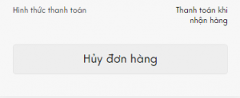
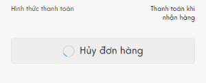

## Chờ chút?

Nếu bạn chưa biết hoặc chưa thực hành redux-saga thì trước hết hãy vượt qua bài hướng dẫn cơ bản và hiểu được [các concept cơ bản](https://redux-saga.js.org/docs/basics/UsingSagaHelpers.html). Tham khảo:

1. https://dev.to/bnorbertjs/async-react-basics-with-redux-thunk–redux-saga-4af7
1. https://blog.logrocket.com/understanding-redux-saga-from-action-creators-to-sagas-2587298b5e71
1. https://medium.com/@lavitr01051977/make-your-first-call-to-api-using-redux-saga-15aa995df5b6
1. https://medium.com/@js_tut/the-saga-continues-magic-in-react-44da8d134285

## Vấn đề đang gặp phải

### Ví dụ kinh điển

Bạn có một button submit form và muốn button được disable hoặc hiển thị trạng thái loading/processing trong khi chờ kết quả trả về, chỉ khi nhận được kết quả thành công hoặc có lỗi mới đưa button trở lại thái ban đầu.

### Cụ thể

Bạn cho phép user hủy đơn hàng khi click button như hình sau:



Nhưng bạn muốn button [Hủy đơn hàng] hiển thị trạng thái đang xử lý và không nhận lệnh trong khi đang chờ kết quả trả về:



Để làm được điều này, chúng ta chỉ có một lựa chọn đó là sử dụng redux store để chứa state `isCancelingOrder` và trong component sẽ phải select `isCancelingOrder` từ redux store với `mapStateToProps()` sau đó đưa state này vào button `[Hủy đơn hàng]` để hiển thị icon loading.

Vấn đề bắt đầu xuất hiện, để hiển thị icon loading, tốt nhất là chỉ nên sử dụng local state của component để bật tắt nó. Nhưng thực tế chúng ta lại phải đẩy trạng thái xử lý của API request vào redux store rồi từ component phải `connect` đến store để lấy thông tin, rồi truyền thông tin đó qua một vài cấp component để biết được API request đã xong hay chưa. Vấn đề này tạm gọi `local state` và `global state`.

## Xử lý async action với redux-saga

Mỗi khi button được click, component sẽ `dispatch()` một action gửi request lên server để kiểm tra tình trạng đơn hàng và thực hiện việc hủy đơn, khi bắt đầu gửi request `isCancelingOrder` sẽ được set thành true và chỉ được set thành `false` khi có kết quả trả về hoặc có lỗi (bao gồm cả lỗi từ server trả về).

Đoạn code sau đây cho phép thực hiện yêu cầu trên trong trường hợp API hủy đơn không bao giờ trả về lỗi (chỉ trả về 2xx response).

```js title=Component
const orderId = "abc-xyz";
this.props.dispatch(cancelOrder({ orderId }));

function cancelOrder(payload) {
  return {
    type: "CANCEL_ORDER",
    payload,
  };
}
```

```js title=Saga
export function* takeCancelOrder({ payload: { orderId } }) {
  yield put({ type: "CANCEL_ORDER_BEGIN" });
  const response = yield call(request, "/huy-don", { orderId });
  yield put({ type: "CANCEL_ORDER_SUCCESS", response });
}

// Individual exports for testing
export default function* rootSaga() {
  yield takeLatest("CANCEL_ORDER", takeCancelOrder);
}
```

```js title=Reducer
const initialState = {
  isCancelingOrder: false,
};

function orderReducer(state = initialState, action) {
  switch (action.type) {
    case "CANCEL_ORDER_BEGIN":
      return Object.assign({}, state, { isCancelingOrder: true });
    case "CANCEL_ORDER_SUCCESS":
      return Object.assign({}, state, { isCancelingOrder: false });
    default:
      return state;
  }
}
```

Nhưng đời không như mơ, đơn hàng bạn đặt đã được đóng gói và sắp được giao đến tay bạn rồi thì bạn không thể hủy được nữa, cuộc sống mà. Trong trường hợp này chúng ta sẽ phải update saga một chút để có thể xử lý trường hợp phát sinh lỗi. Cách nhanh nhất là sử dụng `try catch finally`.

```js
export function* takeCancelOrder({ payload: { orderId } }) {
  try {
    yield put({ type: "CANCEL_ORDER_BEGIN" });
    const response = yield call(request, "/huy-don", { orderId });
    yield put({ type: "CANCEL_ORDER_SUCCESS", response });
  } catch (error) {
    yield put({ type: "CANCEL_ORDER_ERROR", error });
  } finally {
    yield put({ type: "CANCEL_ORDER_FINISH" });
  }
}
```

Đồng thời cũng cần update reducer:

```js
const initialState = {
  error: null,
  isCancelingOrder: false,
};

function orderReducer(state = initialState, action) {
  switch (action.type) {
    case "CANCEL_ORDER_BEGIN":
      return Object.assign({}, state, { isCancelingOrder: true });
    case "CANCEL_ORDER_ERROR":
      return Object.assign({}, state, { error: action.error });
    case "CANCEL_ORDER_FINISH":
      return Object.assign({}, state, { isCancelingOrder: false });
    default:
      return state;
  }
}
```

Có lẽ bạn nghĩ đến đây là hết, chúng ta đã trải phẳng việc xử lý async actions bằng saga và try catch. Nhưng sự thực nó không dừng lại ở đó. Trong một dự án có rất nhiều loại action để xử lý các công việc ([side effect](https://medium.com/appsflyer/dont-call-me-i-ll-call-you-side-effects-management-with-redux-saga-part-1-d0a92c3f81be)) khác nhau: `localStorage, cookie, animation…`

Với mỗi một action như vậy chúng lại sẽ phải lặp đi lặp lại các bước đơn giản hoặc viết đi viết lại những đoạn code như bên trên? Thay vì `callback hell` thì chúng ta lại tạo ra một địa ngục mới `saga hell`. Nếu project của bạn có sử dụng các công cụ kiểm soát chất lượng code như [sonarqube](https://www.sonarqube.org/) hay [codeclimate](https://codeclimate.com/) thì điểm chất lượng sẽ tụt xuống thậm tệ vì code lặp quá nhiều.

`saga hell` chưa phải là điểm dừng. Với cách xử lý state như trên react app còn bị phụ thuộc và redux store, mọi state sinh ra bởi các action đều cần được đưa vào store để có thể tác động trở lại view component. Thật sự là cồng kềnh và khó kiểm soát.

## Hạn chế sự phụ thuộc vào redux store

### Giải pháp với redux-saga

Cách giải quyết rất là đơn giản: làm thế nào để trả về kết quả từ saga vào component mà không cần phải đặt nó vào redux store? =)))

Ai đó: Fuck, man! Giải pháp của ông chỉ là mô tả lại vấn đề thôi à?
Tôi: Bình tĩnh!
Ai đó: Cho xem code đi.
Tôi: Đây, bắt đầu bằng unfoldSaga nhé.

```js
/**
 * Common saga handler
 * Unify handling saga into only one standard form
 *
 * @param payload { handler, key }
 * @param callbacks { callbackOnBegin, callbackOnFailure, callbackOnFinish, callbackOnSuccess }
 */
function* unfoldSaga(
  { handler, key } = {},
  {
    callbackOnBegin,
    callbackOnFailure,
    callbackOnFinish,
    callbackOnSuccess,
  } = {}
) {
  try {
    yield put({ type: createActionTypeOnStart(key) });
    yield call(callbackOnBegin);
    const data = yield call(handler);
    yield put({ type: createActionTypeOnSuccess(key), payload: data });
    yield call(callbackOnSuccess, data);
  } catch (error) {
    yield put({ type: createActionTypeOnFailure(key), payload: error });
    if (process.env.NODE_ENV !== "production") {
      /* eslint-disable no-console */
      yield call(console.log, `Error at ${key} action`);
      yield call(console.log, error);
      /* eslint-enable */
    }
    yield call(callbackOnFailure, error);
  } finally {
    yield put({ type: createActionTypeOnFinish(key) });
    yield call(callbackOnFinish);
  }
}

/**
 * Action type generators
 */
export function createActionTypeOnStart(key) {
  return `${key}_BEGAN`;
}

export function createActionTypeOnFailure(key) {
  return `${key}_FAILED`;
}

export function createActionTypeOnFinish(key) {
  return `${key}_FINISHED`;
}

export function createActionTypeOnSuccess(key) {
  return `${key}_SUCCEEDED`;
}
```

### Giải thích

Với saga trung gian mà tôi gọi là `unfoldSaga` cho nó hoành tráng, chúng ta có thể thống nhất việc xử lý action thông qua một helper duy nhất đồng thời cũng tạo ra một form chung cho các action type đều có chứa `_BEGAN` hay `_FINISHED`. Ở chỗ làm, tôi rất hay phàn nàn các anh em về cách đặt tên biến, tên hàm thiếu nhất quán; với các project React thì có thêm vấn action type, cũng đau đầu muốn chết.

>
_Ai đó_: Callback trong saga à? Dị đời quá nhỉ.<br/>
_Tôi_: Oke, cách dùng đây.

```js
const CANCEL_ORDER = "CANCEL_ORDER";

function* takeCancelOrder({ payload: { orderId } }) {
  yield unfoldSaga({
    handler: async () => {
      const response = await request("/huy-don", { orderId });
      return response; // Or response.json();
    },
    key: "CANCEL_ORDER", // Once and for all
  });
}
```

Trong unfoldSaga kết quả của handler() sẽ được trả lại cho action CANCEL_ORDER_SUCCESS. Gần như xong rồi, sửa lại reducer một chút cũng khá nhanh thôi.

### Kết quả

>
_Ai đó_: Nhìn ngắn gọn hơn nhiều đấy nhỉ!<br/>
_Tôi_: Cứ nói là không đi. :)))<br/>
_Ai đó_: Sao không thấy dùng callback ở đâu nhỉ?<br/>
_Tôi_: Code ngắn gọn hơn rồi. Bây giờ mới đến lúc callback tỏa sáng.

```js
function* takeCancelOrder({ callbacks, payload: { orderId } }) {
  yield unfoldSaga(
    {
      handler: async () => {
        const response = await request("/huy-don", { orderId });
        return response; // Or response.json();
      },
      key: "CANCEL_ORDER", // Once and for all
    },
    callbacks
  );
}
```

Bây giờ thì có thể update action theo phong cách mới rồi, ma thuật này:

```js
this.props.dispatch(
  cancelOrder(
    { orderId },
    {
      callbackOnBegin: () => {
        this.setState({ isCanceling: true });
      },
      callbackOnFailure: (error) => {
        // show error to your users or stay quiet
      },
      callbackOnFinish: () => {
        this.setState({ isCanceling: false });
      },
      callbackOnSuccess: (response) => {
        // whatever
      },
    }
  )
);

function cancelOrder(payload, callbacks) {
  return {
    type: "CANCEL_ORDER",
    payload,
    callbacks,
    // any other things
  };
}
```

>
_Ai đó_: Damn!<br/>
_Tôi_: Khởi tạo state thì thôi, tự viết nhé! :))

Trông thật sự là hứa hẹn. Với cách gọi action ở ngay trên, chúng ta có thể sử dụng local state nhiều hơn thay vì cứ phải đẩy mọi thứ vào redux store. Chấm dứt lạm dụng redux cho những việc đơn giản như hiển thị một icon loading.

Dữ liệu chưa cần đưa vào redux store mà vẫn có thể thao tác từ component. Cái này chắc có thể gọi là half way binding chăng? :))

## Tổng kết

Bài viết hơi nhiều code và dài nhưng chúng ta có thể rút ra vài điều:

- Saga cực kỳ tối ưu cho việc xử lý API request nói riêng và app side effect nói chung
- Saga và Callback có thể cộng tác chứ không triệt tiêu nhau
- Callback Hell là lỗi của bạn chứ không phải javascript

## Nhược điểm

Không có gì là hoàn hảo cả. Mình đã và đang áp dụng giải pháp này cho một vài dự án thì vẫn thấy nó có một số nhược điểm:

- Làm tăng lượng code xử lý logic trong các component
- Dễ khiến anh em quên đi việc sử dụng redux-saga để xử lý side effect

Cảm ơn anh em đã đọc đến đây. ╰(_°▽°_)╯
