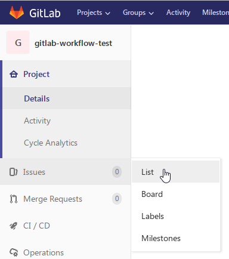
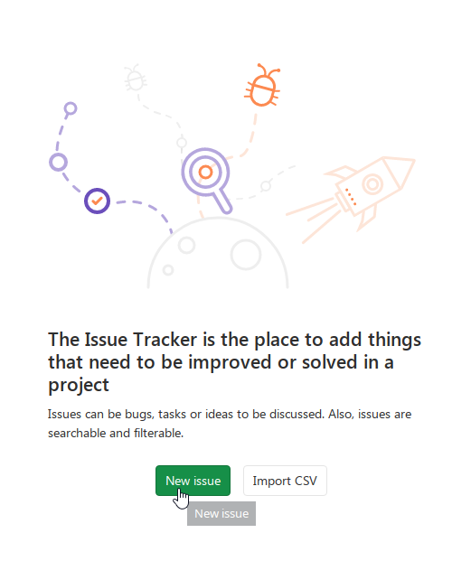
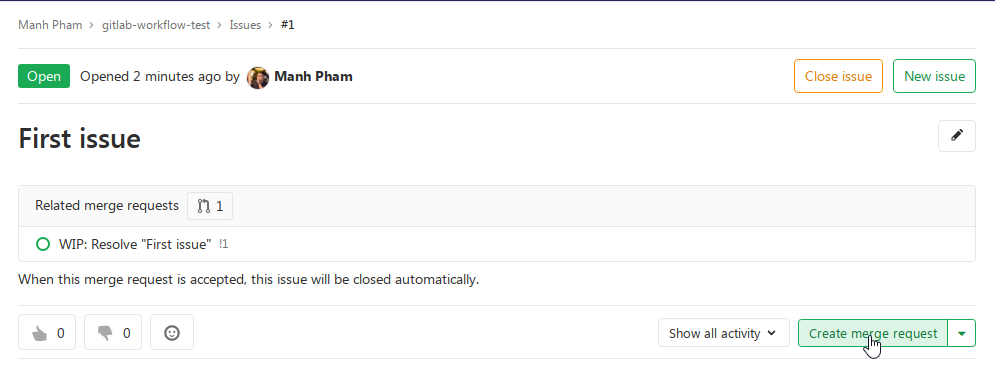
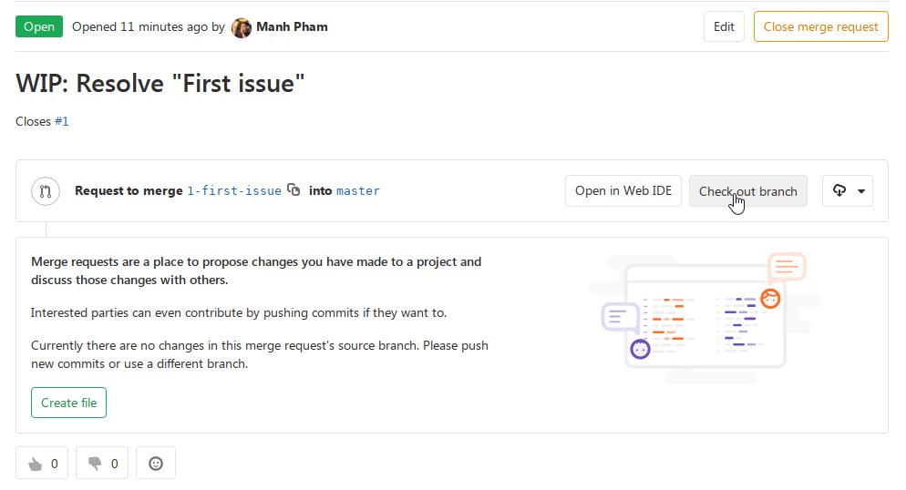
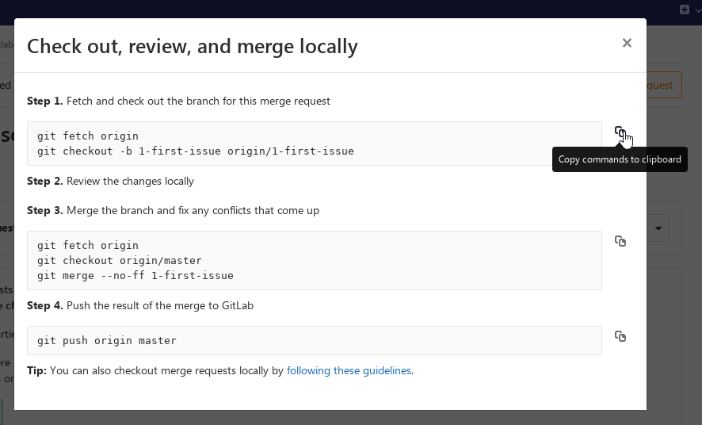

## Giới thiệu Gitlab và [Gitlab Flow](https://docs.gitlab.com/ee/topics/gitlab_flow.html)

Gitlab là một công cụ rất hay và có self-hosted (on-premise) plan cho phép bất cứ ai, công ty hay tổ chức nào cũng có thể cài đặt một Git Platform của riêng mình.

- Một điểm cộng của Gitlab đó là tính năng Gitlab Board, giúp bạn tổ chức và sắp xếp các issue thành các board giống như Trello, khá tiện lợi cho việc quản lý theo quy trình (VD: Agile).
- Gitlab còn cho phép bạn tạo các Merge Request (Pull Request, theo cách nói của Github) dựa trên các issue đã có, đồng thời tạo luôn cả source branch giúp bạn.
- Bên cạnh đó, Gitlab cung cấp Gitlab CI cho phép bạn apply CI/CD vào bất cứ project nào. Với tôi thì đây là một tính năng không thể thiếu khi lựa chọn một công cụ devops.

Trước khi bắt đầu thực hành hoặc đọc tiếp, bạn nên tạo một repo trống để thử nghiệm.

## Tại sao cần Gitlab Flow

Thực tế, gitlab flow hay [git workflow](https://manhpt.com/category/workflow/) không phải một khái niệm mới. Do git không hề dễ học cho người mới nên các workflow của nó thường bị bỏ qua, ngoài ra các nhà cung cấp công cụ devops cũng thường đưa ra những git workflow riêng để phù hợp với luồng devops trên công cụ của họ. Bạn có thể tham khảo thêm:

- Gitlab Flow - [https://docs.gitlab.com/ee/topics/gitlab_flow.html](https://docs.gitlab.com/ee/topics/gitlab_flow.html)
- Github Flow - [https://guides.github.com/introduction/flow/](https://guides.github.com/introduction/flow/)
- Jira Gitflow Workflow - [https://www.atlassian.com/git/tutorials/comparing-workflows/gitflow-workflow](https://www.atlassian.com/git/tutorials/comparing-workflows/gitflow-workflow)

## Bắt đầu tạo một issue

Vào `Issues > List` và chọn `New issue`. Hoặc bạn có thể chọn `Import CSV` để import list task có sẵn từ các nguồn khác như Jira, Redmine...

Click `New issue` như hình minh họa bên dưới.

Điền đầy đủ thông tin tùy theo yêu cầu từng team sau đó `Submit issue`.

## Tạo merge request từ issue

Sau khi đã có issue, ta có thể tạo merge request từ issue đó rất nhanh chỉ cần click `Create merge request`.

Bạn có thể tạo bao nhiêu merge request tùy ý nhưng thường chỉ nên tạo 1 merge request cho mỗi 1 issue.

## Branch đã được tạo sẵn

Sau khi tạo merge request thì Gitlab cũng tạo luôn branch cho bạn.

Sau đó chọn copy câu lệnh checkout mà Gitlab cung cấp sẵn, paste vào terminal/shell của bạn (sau khi đã clone repo) để bắt đầu code.

Đây là các step đơn giản đầu tiên để làm việc với Gitlab Flow. Mọi task như tạo feature mới, fix bug, refactor... đều cần được quy hoạch về step cơ bản này.
