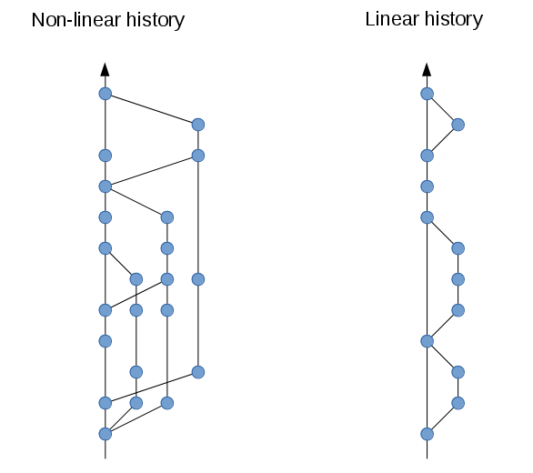
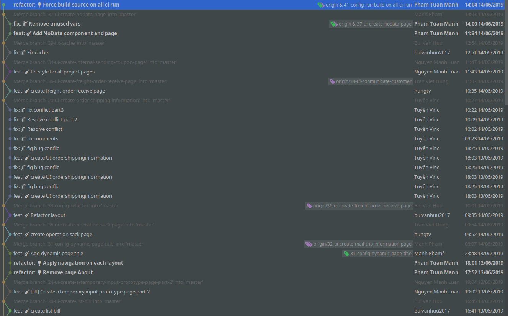

## Bạn có bao giờ tự hỏi

1.  Git còn gì ngoài `git commit`, `git push` và `git pull`? Thỉnh thoảng dùng thêm `git merge`, còn gì nữa không?
2.  `git merge` và `git rebase` khác gì nhau, nên dùng cái nào?
3.  Ở vị trí team leader bạn sẽ vận hành git ra sao để kết hợp với process của team (agile) và giải quyết các conflict trong quá trình code?
4.  Lịch sử git có giá trị như thế nào? Hay bạn chẳng bao giờ để ý đến nó?

Nếu bạn là 1 git command line master thì mọi thứ đều có thể được giải quyết dưới local bằng dòng lệnh. Nhưng khi làm việc trong một nhóm đông thành viên, làm thế nào để xử lý các vấn đề conflict code, release ra sao, thêm feature mới như thế nào, hotfix ra làm sao một cách trơn tru và hiệu quả, giảm thiểu tối đa các bước thủ công, tiến dần đến một git [workflow](/tags/workflow/) tự động hoàn toàn (devops).

## Luôn luôn tạo ra linear history

> Git Workflow được giới thiệu sau đây luôn giữ một tư duy cực kỳ nhất quán về `git history` luôn luôn là `linear history` (có thể hiểu là history trên một đường thẳng). Nhìn trong hình đủ thấy `linear history` dễ hiểu hơn rất nhiều so với `non-linear history`, đủ dễ để nhìn vào graph là có thể thấy được thứ tự của các commit và sự khác nhau giữa các version được release.

### Tham khảo

1.  [http://www.bitsnbites.eu/a-tidy-linear-git-history/](http://www.bitsnbites.eu/a-tidy-linear-git-history/)

## `git merge` và `git rebase` đúng lúc đúng chỗ

### Nguyên tắc tiên quyết

1.  Để update code mới nhất, không `merge` trên local, hãy dùng `rebase`
2.  `merge` tự động bằng `merge (pull) request` (cần cấu hình để khi `merge` sẽ sinh ra một empty commit nhằm đánh dấu vị trí merge)

### Một ví dụ thực tế về linear history

