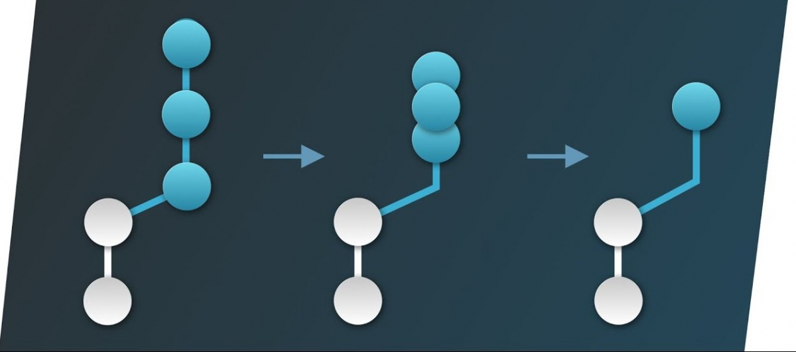

## Vấn đề là...

Trong quá trình code chắc hẳn bạn thường xuyên tạo ra những dumb commit để tránh mất code, hoặc nhiều commit trùng tên nhau. Bạn có bao giờ nghĩ đến việc gộp các commit (squash commit) đó lại thành một commit có ý nghĩa hơn chưa?

Squash commit (gộp commit) là một việc nên làm nhưng không phải ai cũng nghĩ đến. Thậm chí có nghĩ đến thì đa số cũng không muốn làm bởi sợ rằng có thể gây ra mất code. Xin được khẳng định luôn là code một khi đã được commit thì không mất đi đâu được, vô tư đi.

<!-- truncate -->

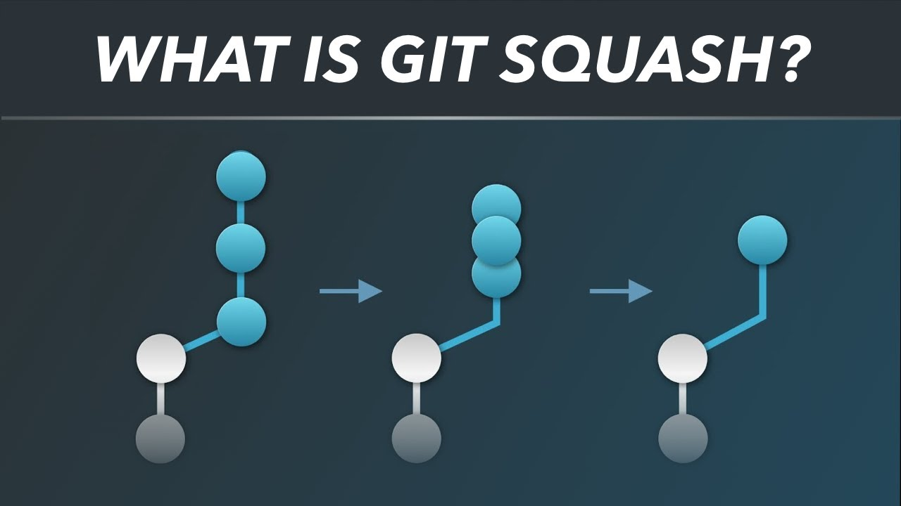 Để squash commit, chúng ta sẽ sử dụng câu lệnh `git rebase -i` hoặc `git rebase --interactive`. Trong nội dung bài viết này tôi sẽ không giải thích về `rebase`. Các bạn có thể tham khảo thêm các bài viết sau để hiểu rõ ràng hơn:

1.  [https://www.atlassian.com/git/tutorials/rewriting-history/git-rebase](https://www.atlassian.com/git/tutorials/rewriting-history/git-rebase)
2.  [https://www.atlassian.com/git/tutorials/merging-vs-rebasing](https://www.atlassian.com/git/tutorials/merging-vs-rebasing)

Bài viết này nằm trong series về [Git Workflow](/tags/workflow/). Các bạn có thể tham khảo bài viết giới thiệu tại [đây](../2019-06-15-git-workflow-gioi-thieu/index.md).

## Trước khi squash

- Bạn nên kiểm tra lại lịch sử của mình trước để xác nhận lại lần cuối những commit mà mình cần squash.
- Copy hash id của commit nằm ngay trước những commit cần squash

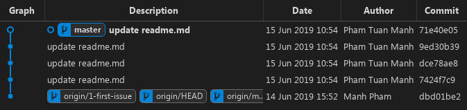

Ví dụ trong ảnh trên, chúng ta có tới 4 commit giống nhau, cùng là `update readme.md`. 4 commit này làm chung một nhiệm vụ là update readme nên có thể gộp lại thành 1 commit, tránh tạo rác trong git history. Để squash được bạn cần có hash id của commit nằm trước tất cả các commit cần squash, VD trong ảnh sẽ là `dbd01be2`.

## Bắt đầu squash commit

### Tổng hợp các commit

- `$ git rebase -i dbd01be2` vào terminal tại root của project.
- Màn hình VIM editor sẽ hiện lên như hình sau, đôi khi `vim` không phải editor mặc định của git mà có thể là `nano` hay một editor nào đó khác do bạn thiết lập sẵn hoặc mặc định của hệ điều hành mà bạn dùng. Không cần quá lo lắng, mục đích chỉ là edit nội dung và cũng chỉ toàn là text mà thôi.

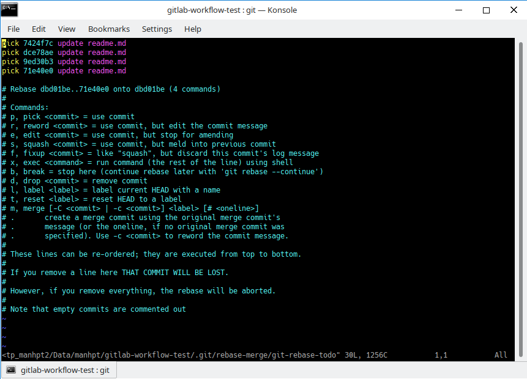

Trong màn hình này, bạn sẽ nhìn thấy 4 commit mà bạn chọn để squash sẽ nằm ở trên cùng, mỗi commit nằm trên 1 dòng với nội dung gồm 3 phần: `pick 7424f7c update readme.md`

1.  `pick` là command, mặc định `pick` là giữ lại commit đó sau quá trình rebase và không thay đổi gì.
2.  `7424f7c` là hash id của commit
3.  `update readme.md` là commit message

Để ý một chút bạn sẽ thấy các hướng dẫn rebase ở phía bên dưới (nằm trong vùng comment) nói chi tiết hơn về các action mà bạn có thể sử dụng khi rebase, hiện tại chúng ta chỉ quan tâm đến action `squash` mà thôi. Nếu bạn `rebase` lần đầu thì hãy đọc kỹ để hiểu rõ hơn về rebase.

### Đổi action của các commit cần squash

Tiếp tục squash:

- Nhấn `i` để có thể edit content
- Trừ commit trên cùng, sửa command của 3 commit sau từ `pick` thành `squash`

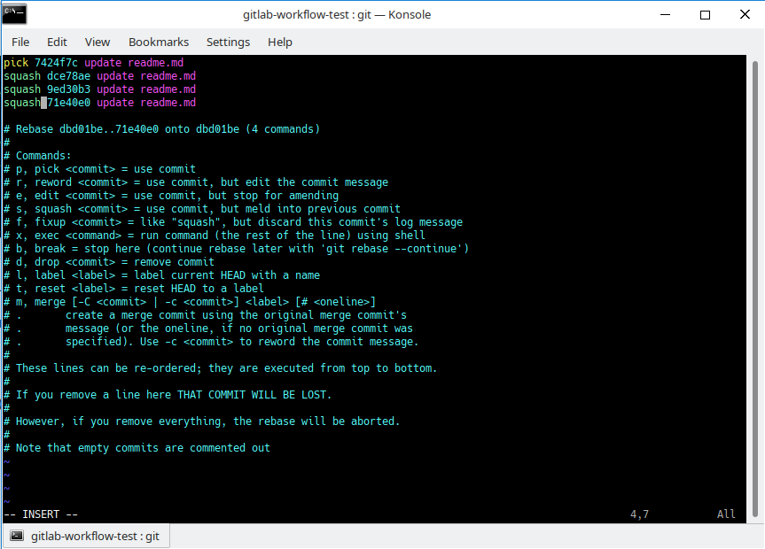

**Chú ý:** Ở màn hình này bạn cần đặc biệt cẩn thận với việc edit thông tin. Squash luôn là gộp với commit trước đó nên commit đầu tiên không thể là `squash`. VD như màn hình trên thì 3 commit sau sẽ được gộp vào commit đầu tiên và tạo ra 1 commit mới. Đừng xóa bất cứ dòng nào không phải commit `#`. Nếu bạn xóa 1 dòng thì commit tại dòng đó sẽ bị mất.

- Nhấn `Esc` để thoải khỏi `INSERT` mode
- Gõ `:wq` để write nội dung và quit ra khỏi VIM editor

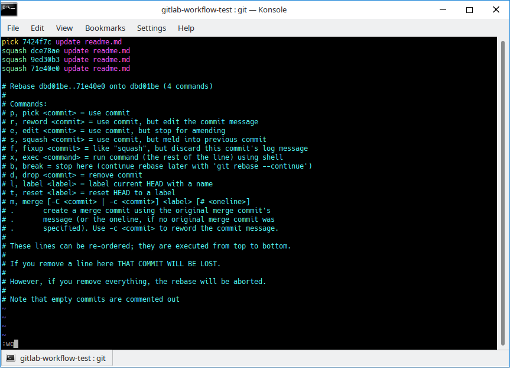

### Cập nhật commit message của commit mới (commit sau khi gộp)

Bạn tiếp tục được chuyển tới một màn hình VIM editor mới. Nhiệm vụ lần này là để update commit message cho commit mới - là kết quả gộp của 4 commit trước đó. Git đơn giản tổng hợp lại 4 commit message trước đó để bạn có thể chọn hoặc sửa để thay thế mới.

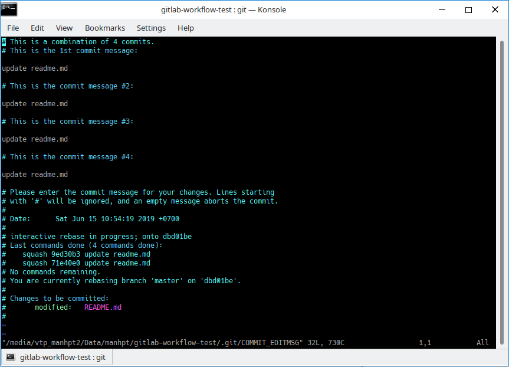

- Xóa bớt và chỉ giữ lại những gì bạn thấy cần.
- Comment có thể bỏ qua vì sẽ không được đưa vào commit message thực tế
- Gõ `:wq` để write và quit

Kết quả trên command line sẽ là:

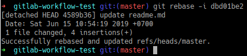

## Sau khi squash commit

Lịch sử git mới mà bạn nhận được sẽ là:

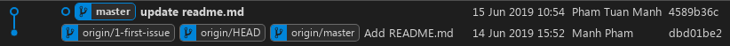

Có thể thấy commit được gộp lại là commit mới hoàn toàn vì có hash khác. Trong trường hợp bạn muốn undo việc squash, chỉ cần kiểm tra với `git reflog`:

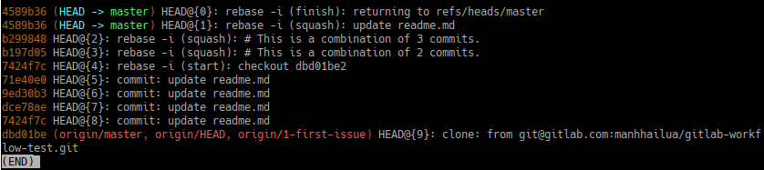

Ở bên trái bạn sẽ thấy các commit hash id cũ. Để undo bạn chỉ cần copy hash id của commit cuối cùng (trong 4 commit được gộp là `71e40e0`) sau đó nhập vào terminal: `$ git reset --hard 71e40e0` Kiểm tra lịch sử, mọi thứ như chưa từng xảy ra. Tuyệt cmn vời!

## Bonus

Sau thời điểm reset bạn có muốn thử kiểm tra `git reflog` xem điều gì đã xảy ra không? Magic... :))

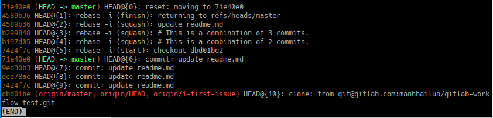
