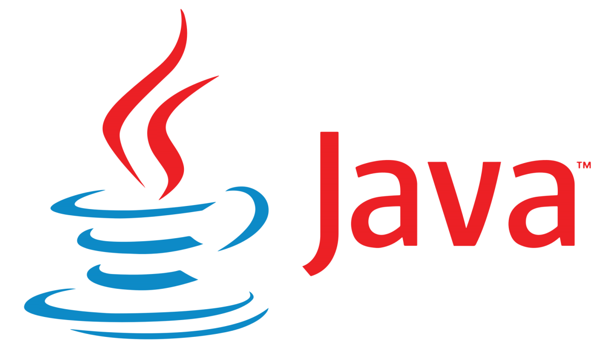

## Vấn đề là...

Có nhiều lúc bạn cần sử dụng một phiên bản nhất định của Java để phục vụ công việc, ví dụ như build app android thì cần Java 8 trong khi version mới nhất của Java hiện đã là 11 (tại thời điểm viết bài).

Sau đây là một vài bước đơn giản để bạn có thể thiết lập môi trường MacOS sử dụng một phiên bản nhất định (trong trường hợp máy bạn cài đặt nhiều phiên bản Java) và thay đổi giữa các phiên bản của Java.

Bạn không cần phải cài đặt thêm bất cứ plugin hay thư viện nào để có thể thực hiện các bước sau đây.

## 1. Đầu tiên bạn cần list ra tất cả các version Java hiện có trên máy bằng câu lệnh sau:

```shell
/usr/libexec/java_home -V
```

Bạn có thể sẽ nhận được nội dung như sau:

```
Matching Java Virtual Machines (3):
1.8.0_202, x86_64:   "Java SE 8" /Library/Java/JavaVirtualMachines/jdk1.8.0_05.jdk/Contents/Home
1.6.0_65-b14-462, x86_64:   "Java SE 6" /System/Library/Java/JavaVirtualMachines/1.6.0.jdk/Contents/Home
1.6.0_65-b14-462, i386: "Java SE 6" /System/Library/Java/JavaVirtualMachines/1.6.0.jdk/Contents/Home

/Library/Java/JavaVirtualMachines/jdk1.8.0_202.jdk/Contents/Home
```

## 2. Chọn version mà bạn muốn chọn làm mặc định

Ví dụ tôi chọn version `1.6.0_65-b14-462` làm mặc định thì chỉ cần:

```shell
export JAVA_HOME=$(/usr/libexec/java_home -v 1.6.0_65-b14-462)
```

Bạn cũng có thể đặt câu lệnh này vào `.bashrc` hoặc `.zshrc` của bạn để auto exec mỗi khi bạn mở một shell session mới.

## 3. Kiểm tra lại với `java -version` bạn sẽ nhận được thông tin tương ứng

```
java version "1.6.0_65"
Java(TM) SE Runtime Environment (build 1.6.0_65-b14-462-11M4609)
Java HotSpot(TM) 64-Bit Server VM (build 20.65-b04-462, mixed mode)
```

## Bonus:

Bạn còn có thể:

```shell
export JAVA_HOME=$(/usr/libexec/java_home -v 1.8)
```

hoặc

```shell
	
export JAVA_HOME=$(/usr/libexec/java_home -v 1.6)
```

Thiết lập như thế này sẽ hỗ trợ chọn version linh hoạt hơn. Đồng thời vẫn đảm bảo khả năng tương thích trong cùng một phiên bản Java.
