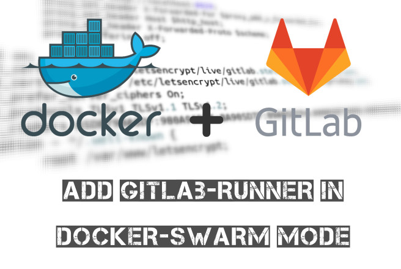

## Why docker swarm? Liên quan gì đến gitlab-runner?

Setup gitlab-runner trên môi trường docker bình thường khá đơn giản trong bài viết [này](../2019-06-21-gitlab-cai-dat-gitlab-runner-su-dung-moi-truong-docker/index.md). Nhưng nếu bạn có nhiều máy (máy tính local hoặc server) thì sao? Setup gitlab-runner cho từng máy không phải là một ý hay:

> Kết hợp các máy này lại với nhau, tạo thành một cụm docker swarm.

## Điều kiện cần

### Docker swarm

Có lẽ bạn đã có sẵn môi trường docker swarm trước khi tìm thấy bài viết này. Còn nếu chưa thì bạn vui lòng tham khảo:

- [Overview](https://docs.docker.com/engine/swarm/)
- [Installation](https://docs.docker.com/engine/swarm/swarm-tutorial/create-swarm/)

### Tokens

Bạn vui lòng google hoặc tham khảo nội dung `swarm.yml` bên dưới để biết cách lấy token.

- Gitlab runner registration token (có thể lấy của từng project hoặc group)
- Gitlab personal access token ([tại đây](https://gitlab.com/profile/personal_access_tokens))

## Deploy stack gitlab-runner

Tạo một file `swarm.yml` với nội dung như sau:

```yaml
version: '3.7'

secrets:

  # Find your registration token at: "Your project" > "Settings" > "CI/CD" > "Runners settings" > "Specific Runners" (look for registration token)
  # Register it as `GITLAB_REGISTRATION_TOKEN`: `docker secret create GITLAB_REGISTRATION_TOKEN YOUR_REGISTRATION_TOKEN`
  GITLAB_REGISTRATION_TOKEN:
    external: true
  # Find your personal access token at: "Your user account" > "Settings" > "Access Tokens" > "Create personal access token" (for api)
  # Register it as `GITLAB_PERSONAL_ACCESS_TOKEN`: `docker secret create GITLAB_PERSONAL_ACCESS_TOKEN <YOUR ACCESS TOKEN>`
  GITLAB_PERSONAL_ACCESS_TOKEN:
    external: true

services:

  # Gitlab Runner - https://gitlab.com/gitlab-org/gitlab-runner
  runner:
    image: gitlab/gitlab-runner:latest
    environment:
      - CONCURRENT=8
      - REGISTER_LOCKED=1
      - REGISTER_NON_INTERACTIVE=1
      - RUNNER_EXECUTOR=docker
      - DOCKER_IMAGE=docker
      - DOCKER_VOLUMES=/var/run/docker.sock:/var/run/docker.sock
      - RUNNER_NAME=docker
      - API_URL=https://gitlab.com/api/v4
      - CI_SERVER_URL=https://gitlab.com/ci
    entrypoint: "bash"
    secrets:
      - GITLAB_REGISTRATION_TOKEN
    command: |
      -c '
        set -e
        printf "Setting configuration...\\n"
        export REGISTRATION_TOKEN="$$(cat /run/secrets/GITLAB_REGISTRATION_TOKEN)"
        sed -i "s/^concurrent = .*/concurrent = $${CONCURRENT}/" /etc/gitlab-runner/config.toml
        printf "\\n"
        printf "Registering runner...\\n"
        gitlab-runner register --non-interactive
        printf "\\n"
        printf "List runners...\\n"
        gitlab-runner list
        printf "\\n"
        printf "Running runner...\\n"
        gitlab-runner run --user=gitlab-runner --working-directory=/home/gitlab-runner
      '
    volumes:
      - /var/run/docker.sock:/var/run/docker.sock
    deploy:
      mode: global
      placement:
        constraints:
          - node.role == manager
      labels:
        - "traefik.enable=false"
    healthcheck:
      test: ["CMD-SHELL", "gitlab-runner verify --name docker 2>&1 | grep --quiet \"is alive\""]
      start_period: 10s
      interval: 10s
      timeout: 10s
      retries: 10

  # Gitlab Manager to unregister GitLab Runners
  manager:
    image: alpine:latest
    environment:
      - API_URL=https://gitlab.com/api/v4
      - CI_SERVER_URL=https://gitlab.com/ci
    secrets:
      - GITLAB_PERSONAL_ACCESS_TOKEN
    entrypoint: sh
    command: |
      -c '
        set -e
        printf "Installing dependencies...\\n"
        apk --no-cache add curl jq
        printf "\\n"
        export PERSONAL_ACCESS_TOKEN="$$(cat /run/secrets/GITLAB_PERSONAL_ACCESS_TOKEN)"
        while true; do
          printf "Checking runners...\\n"
          curl -sS --header "PRIVATE-TOKEN: $${PERSONAL_ACCESS_TOKEN}" "$${API_URL}/runners?per_page=100" | \
          jq -c ".[] | select(false==.is_shared) | select(\"online\"==.status) | .id" | \
          while read RUNNER_ID; do
            printf "Runner $${RUNNER_ID} is online\\n"
          done
          curl -sS --header "PRIVATE-TOKEN: $${PERSONAL_ACCESS_TOKEN}" "$${API_URL}/runners?per_page=100" | \
          jq -c ".[] | select(false==.is_shared) | select(\"online\"!=.status) | .id" | \
          while read RUNNER_ID; do
            printf "Deleting runner $${RUNNER_ID}...\\n"
            curl -sS --request DELETE --header "PRIVATE-TOKEN: $${PERSONAL_ACCESS_TOKEN}" "$${API_URL}/runners/$${RUNNER_ID}"
          done
          printf "All offline runners deleted\\n"
          printf "Waiting for 24 hours...\\n"
          sleep 24h
        done
        printf "\\n"
      '
    deploy:
      labels:
        - "traefik.enable=false"
    healthcheck:
      test: ["CMD-SHELL", "command -v curl"]
      start_period: 10s
      interval: 10s
      timeout: 10s
      retries: 10

  # Gitlab Runner Docker Cleanup - https://gitlab.com/gitlab-org/gitlab-runner-docker-cleanup
  cleaner:
    image: quay.io/gitlab/gitlab-runner-docker-cleanup
    environment:
      - CHECK_PATH=/data
      - LOW_FREE_SPACE=10G
      - EXPECTED_FREE_SPACE=20G
      - LOW_FREE_FILES_COUNT=1048576
      - EXPECTED_FREE_FILES_COUNT=2097152
      - USE_DF=1
      - CHECK_INTERVAL=10s
      - RETRY_INTERVAL=30s
      - DEFAULT_TTL=60m
    volumes:
      - /var/run/docker.sock:/var/run/docker.sock
      - cleaner_data:/data
    deploy:
      restart_policy:
        condition: any
      labels:
        - "traefik.enable=false"

volumes:
  cleaner_data:
```

Deploy stack này:

```shell
docker stack deploy -c swarm.yml runner
```

Xong rồi đó! Nếu không one hit lên luôn thì tự google nhé =)).
