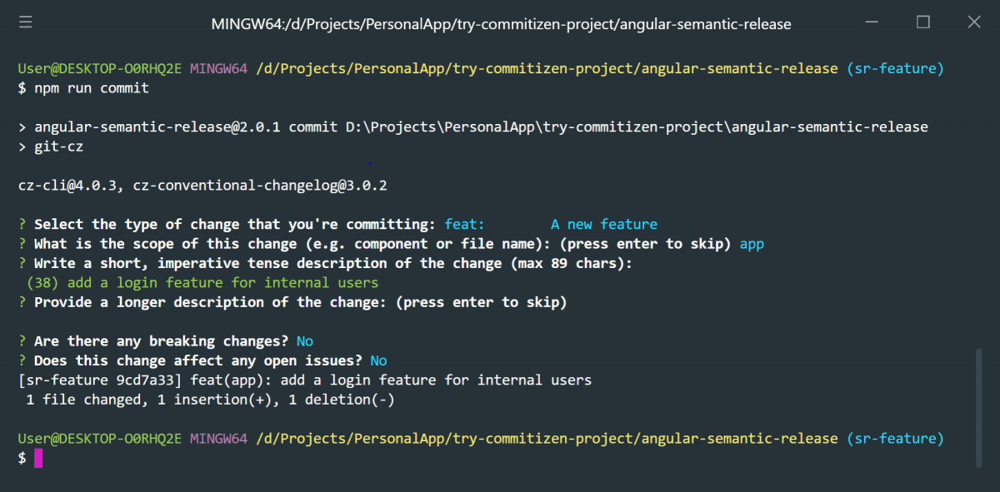

## Lịch sử git thiếu nhất quán

Hầu hết developer chúng ta đều biết đến [git](https://git-scm.com/book/en/v2/Getting-Started-What-is-Git%3F) - nếu chưa biết thì phải tìm hiểu và sử dụng ngay - một công cụ quá tuyệt vời để quản lý source code. Và giống như việc đặt tên biến trong code, commit messages cũng là một thứ gì đó thực sự gây đau đầu.

Trong một team, có anh em sẽ chỉ đặt một message ngắn ngủn cho xong, một số cẩn thận sẽ viết rõ những thay đổi trong đó và chèn thêm cả JIRA ticket number. Như thế sẽ tạo ra sự thiếu nhất quán trong lịch sử commit vốn đã rất phức tạp. Điều này khiến mình nghĩ đến việc chuẩn hóa commit trong project hiện tại.

## Lựa chọn công cụ

Để có một commit có đầy đủ ý nghĩa với: loại commit (feature, fix bug, refactor...), JIRA ticket number, description. Sau thời gian ngâm cứu trên mạng thì mình đã tìm ra [Commitizen](http://commitizen.github.io/cz-cli/) và quyết định sử dụng nó để áp `chuẩn` cho việc commit.

Commitizen là công cụ dạng command line (dòng lệnh) hỗ trợ tự động format commit messages bằng cách hỏi bạn một vài câu hỏi, bạn nhập câu trả lời và commitizen sẽ tạo commit theo chuẩn dựa trên các thông tin được nhập. Bạn có thể cài đặt commitizen global với:

```shell
npm install commitizen -g
```

Không thích cài global thì có thể cài vào dev dependencies của package.json cũng ok:

```shell
npm install commitizen --save-dev
```

Giờ thì thay vì commit bằng lệnh:

```shell
git commit
```

Ta dùng:

```shell
git cz
```

## Cấu hình commitizen

Để bắt đầu làm việc với commitizen, chúng ta cần cài đặt thêm một vài cấu hình có sẵn trong package.json gọi là `adapter`. Những adapter này sẽ định nghĩa những câu hỏi khi commit. Bạn có thể chọn một adapter từ [đây](https://github.com/commitizen/cz-cli#adapters).

Trong bài viết này mình chọn [cz-conventional-changelog](https://www.npmjs.com/package/cz-conventional-changelog) để bắt đầu, bạn cũng nên cài nó vào dev dependencies.

```shell
npm install cz-conventional-changelog --save-dev
```

Tiếp tục cấu hình adapter với lệnh sau:

```shell
commitizen init cz-conventional-changelog --save-dev
```

cz-conventional-changelog sẽ ép commit message theo chuẩn như sau:

```
type(scope): JIRA-Ticket - Short description
```

Sau khi gõ lệnh "git cz", dòng lệnh sẽ đưa ra những câu hỏi về: `type`, `scope`, `short description`, `long description`, `breaking changes` - vui lòng đọc kỹ các câu hỏi trước khi chọn hoặc trả lời, việc này khá dễ dàng và sẽ rất nhanh quen thôi.

## Cấu hình validate commit message

Adapter cz-conventional-changelog không yêu cầu nhập JIRA ticket number nên chúng ta cần kiểm tra dòng đầu của commit message để chắc chắn nó có chưa JIRA ticket number. Ta có thể làm điều này với [Husky](https://github.com/typicode/husky) và [validate-commit-message](https://github.com/Frikki/validate-commit-message). Để bắt đầu thì cũng cài 2 tool này dạng dev dependencies:

```shell
npm install husky --save-dev
npm install validate-commit-msg --save-dev
```

Husky là một tool cho phép ta có thể chạy kèm lệnh bất kỳ với [git hooks](https://git-scm.com/docs/githooks), còn validate-commit-message thì sử dụng regex kiểm tra string. Để cấu hình 2 tool này thì chúng ta cần thêm thủ công đoạn config sau vào bên dưới "config" trong package.json:

```js
"validate-commit-msg": {
  "types": [
    "feat",
    "fix",
    "docs",
    "style",
    "refactor",
    "perf",
    "test",
    "chore",
    "revert"
  ],
  "warnOnFail": false,
  "maxSubjectLength": 72,
  "subjectPattern": "^[A-Z]+-[0-9]+ - .*",
  "subjectPatternErrorMsg": "Subject must be in format 'CMS-123 - Commit message'",
  "helpMessage": ""
}
```

## Commit theo chuẩn không chỉ cho đẹp

Ngoài cải thiện tính dễ dễ hiểu của commit messages. Việc commit theo chuẩn chung như trên còn có rất nhiều lợi ích khác:

- Quan trọng nhất phải kể đến đó là có thể đánh version phần mềm dựa trên commit (theo https://semver.org/)
- Trigger thay đổi trên các tool dự án (JIRA)
- CICD support
- ...

## Tận hưởng kết quả

Done rồi, commitizen đã sẵn sàng để bảo vệ sự trong sáng và nhất quán trong lịch sử git của bạn. Bài viết dựa trên kinh nghiệm cá nhân và có sự tham khảo + dịch lại từ: [https://dev.bleacherreport.com/how-we-use-commitizen-to-clean-up-commit-messages-a16790dcd2fd](https://dev.bleacherreport.com/how-we-use-commitizen-to-clean-up-commit-messages-a16790dcd2fd).
