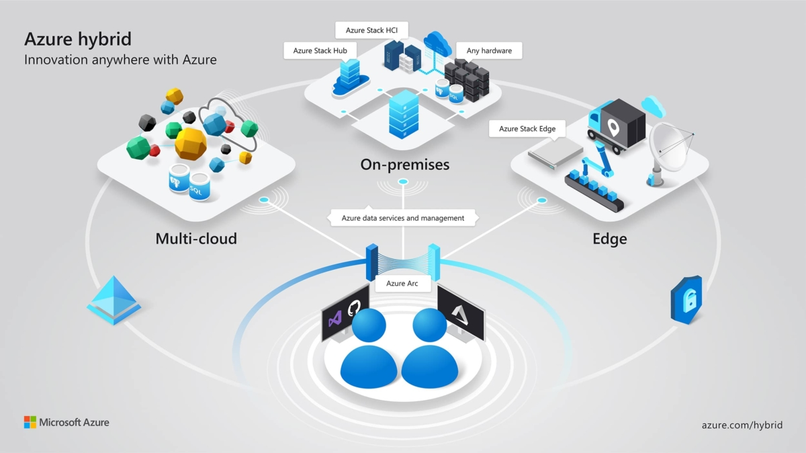

Khi [Cloud Native](https://pivotal.io/cloud-native) tiếp tục đà phát triển mạnh mẽ trong cộng đồng, ngày càng nhiều tổ chức áp dụng những công nghệ và kỹ thuật, ứng dụng đi kèm của nó. Hãy điểm qua những gì được mong đợi sẽ diễn ra trong năm 2020. Kubernetes đã không còn là một công nghệ mới và tên của nó đang lùi dần vào sau hậu trường. Sự tập trung sẽ được dành cho việc xây dựng các phương thức trừu tượng (abstractions) - để giảm độ phức tạp, công cụ và nền tảng bởi các cộng đồng đang không ngừng phát triển. Dưới đây là 7 xu hướng đáng quan tâm trong năm 2020:

## 1. GitOps trở thành tiêu chuẩn cho Cloud Native

Một trong những xu hướng được mong chờ nhất trong năm 2019 là sự ra đời của GitOps. Là một phần mở rộng tự nhiên cho Cơ sở hạ tầng dưới dạng Mã (Infrastructure-as-Code) và Phân phối liên tục (Continuous Delivery). GitOps tập trung vào việc sử dụng Git làm cơ sở duy nhất (single source of truth) cho hệ thống. Thay đổi về cơ sở hạ tầng và ứng dụng được thực hiện bằng cách khai báo thông qua [git repository](https://git-scm.com/book/en/v2/Git-Basics-Getting-a-Git-Repository) (sau đây gọi tắt là git repo hoặc repo), với quy trình tự động đảm bảo trạng thái hiện tại của hệ thống phản ánh lại trạng thái trong repo. Thuật ngữ GitOps được đưa ra bởi [Weave Works](https://www.weave.works/technologies/gitops/), bạn có thể đọc thêm qua blog của họ tại [đây](https://blog.container-solutions.com/11-reasons-for-adopting-gitops). [GitOps Engine](https://github.com/argoproj/gitops-engine) là sản phẩm được tạo ra từ sự hợp tác giữa WeaWorks Flux và Intuit’s Argo, cho thấy tiềm năng tuyệt vời của công cụ tiêu chuẩn để thực hiện GitOps. Mong đợi có nhiều công cụ hơn sẽ tham gia hợp tác trong năm nay để có thể tham gia vào các dự án triệt để hơn. GitOps đang ở giai đoạn đầu tiên được đón nhận bởi cộng đồng, nhưng được dự đoán sẽ trở thành một tiêu chuẩn cho tất cả các công ty có tham vọng hướng đến Cloud Native vào năm 2020.

## 2. Hybird Cloud là tương lai

Dù bạn có là fan của nó hay không, thì [Hybrid hoặc Multi Cloud](https://www.redhat.com/en/topics/cloud-computing/what-is-hybrid-cloud) dường như sẽ là tương lai của các giải pháp Cloud Native. Trong tương lai, rõ ràng là không còn bất kỳ tổ chức lớn nào chạy hoàn toàn trên một cloud, cho dù cloud đó là on-premise, public hay private. Vì nhiều lý do: bảo mật dữ liệu, phục hồi dữ liệu sau thảm họa (DR), quy mô xử lý, bảo mật dữ liệu cá nhân… giải pháp hybrid hoặc multi cloud sẽ được tin dùng hơn. Kết quả là, trong năm vừa qua, cả ba nhà cung cấp điện toán cloud lớn đã tung ra một sản phẩm để hỗ trợ hybrid cloud lai (AWS Outposts, Google’s Anthose, and Azure Arc). Một trong những điểm hấp dẫn chính của Kubernetes đối với nhiều tổ chức là cách nó tự giới thiệu bản thân như một công cụ để thiết lập hybrid cloud. Mặc dù điều này đúng ở một mức độ nào đó, nhưng hỗ trợ nhiều cloud sẽ dẫn đến rất nhiều sự phức tạp. Có một số công cụ nhằm giúp đơn giản hóa việc này, [Kubefed](https://github.com/kubernetes-sigs/kubefed) - còn gọi là Federation v2, [Crossplane](https://crossplane.io/) hoặc thông qua một lưới dịch vụ (service mesh) như [Istio](https://istio.io/). Trong năm tới, hy vọng cộng đồng và các công cụ sẽ tiếp tục phát triển, đồng thời các công ty đang tìm cách thực hiện các thiết lập hybrid cloud sẽ đánh giá lại kỳ vọng của họ khi họ nhận ra việc này tốn khá nhiều chi phí.

## 3. Kubernetes phải coi 2020 là năm của Developer

Một trong những lời chỉ trích lớn nhất về Kubernetes là nó không thân thiện với Developer. Đối với các nhóm quản trị (operations) và nền tảng (platforms), Kubernetes là một người hỗ trợ tuyệt vời. Nhưng thường thì các developer lại cảm thấy bị tụt hậu. Nó tạo thêm sự phức tạp trong vòng đời phần mềm của họ, họ phải học các công nghệ mới mà không có thêm nhiều lợi ích (có thể nhìn thấy). Có một môi trường phát triển giống như sản xuất vẫn còn rất khó khăn trong thế giới của các ứng dụng hướng đến Cloud Native, microservice và phân tán. [Ambassador](https://www.getambassador.io/), [Draft](https://draft.sh/), và [Garden](https://garden.io/) đang nỗ lực rất nhiều để giải quyết vấn đề này. Hy vọng năm 2020 sẽ là năm mà Kubernetes trở nên thân thiện hơn với các developer. Nhiều đội sẽ rời bỏ K8S nếu vấn đề này không được giải quyết.

## 4. SRE sẽ đi từ buzzword đến phổ biến

Kể từ khi Google phát hành ‘[Site Reliability Engineering](https://landing.google.com/sre/books/)’ (Kỹ thuật ổn định hệ thống) lần đầu tiên và liệt kê chi tiết về cách thức vận hành các hệ thống sản xuất, thuật ngữ và vai trò đã tiếp tục phát triển nhanh chóng. Đến năm 2019, SRE vẫn đang rất phổ biến dựa trên các [khảo sát gần đây](https://www.sresurvey2019.com/). Hầu hết các công ty đang triển khai SRE trong tổ chức của họ, nhưng một số lượng lớn trong số họ không áp dụng đúng quy trình và thay vào đó chỉ đơn giản là đổi thương hiệu cho các nhóm vận hành. Cuộc khảo sát tương tự từ Catchpoint, được liên kết ở trên, chỉ ra rằng SLO (Service Level Objectives - Mục tiêu cấp độ dịch vụ) thường không được xác định và vẫn còn quá nhiều vấn đề trong tổ chức - hai số liệu chính của SRE. Với thực tiễn đang tiếp tục trưởng thành và phổ biến hơn, các quy trình sẽ trở nên nghiêm ngặt hơn. Bao gồm đánh giá sản xuất kỹ lưỡng cho tất cả các dịch vụ và SLO/SLI/SLA được xác định rõ, và để SRE thích hợp trở thành một yêu cầu khắt khe đối với bất kỳ công ty nào duy trì hệ thống sản xuất.

## 5. ’Remote first’ sẽ cung cấp cho các công ty nhiều lợi thế hơn

Làm việc từ xa không chỉ là mong muốn của người lao động, mà nó còn buộc tạo ra các thực tiễn tốt nhất về mặt giao tiếp và chủ động. (Dưới 32% những người tham gia [khảo sát developer hàng năm của Stack Overflow](https://insights.stackoverflow.com/survey/2019##job-priorities) vào năm 2019 cho biết cơ hội làm việc từ xa là quan trọng nhất đối với họ khi việc lựa chọn công việc.) Các công cụ và thực tiễn được yêu cầu để hỗ trợ công việc từ xa có lợi bất kể tổ chức đó có nhân viên làm việc từ xa hay không. Điều này có liên quan gì với Cloud Native? Cloud Native không chỉ là về công nghệ. Từ góc độ của [Luật Conway](https://en.wikipedia.org/wiki/Conway%27s_law), nếu chúng ta muốn xây dựng các hệ thống phân tán quy mô lớn với các giao diện khai báo rõ ràng, chúng ta nên xem xét để thực hiện những điều tương tự với cấu trúc tổ chức của mình. Với việc thúc đẩy công việc từ xa tiếp tục, các công ty cung cấp phương pháp làm việc từ xa có hy vọng sẽ có lợi thế đáng kể so với các đối thủ cạnh tranh.

## 6. MLOps mở ra những cơ hội mới

Mặc dù không nhất thiết phải triển khai theo hướng Cloud Native, nhưng việc giới thiệu [MLOps](https://mlops.org/) vào năm 2019 là một sự phát triển thú vị. MLOps là quá trình vận hành và quản lý vòng đời của machine learning trong sản xuất, đặc biệt là áp dụng các công cụ và thực tiễn của DevOps cho lĩnh vực khoa học dữ liệu. Có thể coi đây là cầu nối giữa machine learning và Cloud Native, vì nó cho phép các nhóm khoa học dữ liệu và ML tận dụng các thực tiễn và công nghệ của Cloud Native. Cơ hội ở đây là rất lớn, và mong đợi lĩnh vực này sẽ thực sự bùng nổ trong năm tới.

## 7. Tranh luận về đạo đức sẽ ngày càng lớn hơn và cấp bách hơn

Trong vài năm qua, những lo ngại về [đạo đức và công nghệ](https://blog.container-solutions.com/tech-ethics-what-should-we-do) đã trở thành tâm điểm, từ việc các công ty [sử dụng dữ liệu](https://www.forbes.com/sites/marymeehan/2019/11/26/data-privacy-will-be-the-most-important-issue-in-the-next-decade/##2ad1d8e71882) cho đến vấn đề [tiêu thụ năng lượng của các trung tâm dữ liệu](https://fortune.com/2019/09/18/internet-cloud-server-data-center-energy-consumption-renewable-coal/). Đây đều là những nội dung quan trọng. Từ góc độ Cloud Native, sẽ có nhiều cuộc thảo luận hơn vào năm 2020 về việc làm thế nào để giúp giảm lượng khí thải carbon và nhiều nội dung khác nữa.

## Phần kết luận

Trong khi bản thân công nghệ Cloud Native ngày càng trở nên chủ đạo, không gian chỉ phát triển nhanh hơn. Việc áp dụng các công nghệ chính như Kubernetes tiếp tục mở rộng, dẫn đến nhu cầu trừu tượng hóa và công cụ bổ sung. Đây là một vài trong số các nội dung đáng chú ý trong năm nay, nhưng các lĩnh vực chưa được khám phá chắc chắn sẽ phát sinh vào năm 2020 mới là điều hấp dẫn hơn. Nguồn: [https://blog.container-solutions.com/](https://blog.container-solutions.com/7-cloud-native-trends-to-watch-in-2020)
