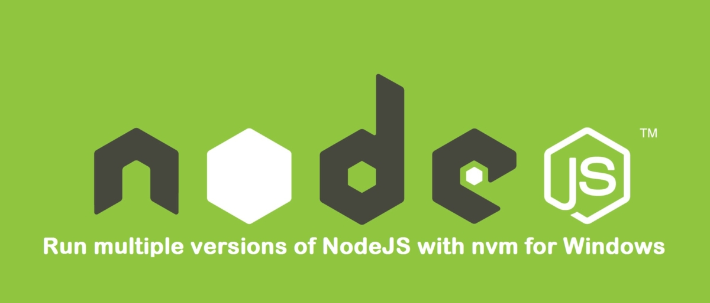

## Chuyển từ MacOS hay Ubuntu về sử dụng Windows

Mình gần như đã từng là fan của Apple khi mà sử dụng iPhone, Macbook cho cuộc sống và công việc. Việc cho phép cài đặt phần mềm qua dòng lệnh khá là lý tưởng với một developer như mình. Ngoài ra, ngày còn khờ dại, đọc được thông tin đâu đó về việc NodeJs được tạo ra trên MacOS đã khiến mình quyết định mua chiếc Macbook đầu tiên - mình là một NodeJS Developer.

## Chocolatey và sự ảnh hưởng của thói quen trên MacOS

Sau khoảng 5 năm liên tục sử dụng MacOS thì cuối cùng mình đã quyết định quay trở lại với Windows. Lý do là muốn một sự thay đổi và cũng là để phục vụ niềm yêu thích chơi game (thực ra là sau khi xem phim The Witcher). Và đương nhiên khi trở lại sử dụng windows mình đã gặp phải một số vấn đề. Vấn đề lớn nhất mà mình thấy là việc cài đặt phần mềm và các công cụ phát triển phần mềm. Search một hồi thì cũng tìm ra [Chocolatey](https://chocolatey.org/), người anh em cùng cha khác ông nội với [Homebrew](https://brew.sh/) (MacOS) và [Snap](https://snapcraft.io/) (Ubuntu). Trải nghiệm sử dụng khá tương đồng, chỉ tiếc là số lượng trong thư viện của nó hơi thua kém so với Homebrew. Bạn có thể cài đặt chocolatey theo hướng dẫn tại đây: [https://chocolatey.org/install](https://chocolatey.org/install).

## Vấn đề về quản lý nhiều [nodejs](/tags/nodejs/) version trên windows

Với Chocolatey bạn có thể cài đặt hầu hết những phần mềm phổ biến, thậm chí có thể [upgrade](https://chocolatey.org/docs/commandsupgrade#usage) các phần mềm đã được cài đặt qua Chocolatey chỉ với một câu lệnh. Như mình đã nói ở trên, mình là một NodeJS Developer; và mình nhanh chóng nhận ra vấn đề: quản lý và sử dụng nhiều nodejs version cùng lúc. Tất nhiên là mình hay bạn đều nghĩ ngay đến [nvm](https://github.com/nvm-sh/nvm). Nghĩ sao là làm vậy thì rất tiếc là nvm mà chúng tay vẫn hay dùng trên MacOS hay các linux distro khác lại không hoạt động trên windows. Search luôn cụm từ "nvm windows" thì cũng tìm ra được một tool phù hợp và thậm chí còn có thể cài đặt được qua Chocolatey: [nvm-windows](https://github.com/coreybutler/nvm-windows).

```shell
choco install -y nvm
```

Để cài đặt và sử dụng nodejs với nvm thì bạn chỉ cần:

```shell
# nvm install <version>
# nvm use <version>
nvm install 12.16.1
nvm use 12.16.1
node --version # should show 12.16.1
nvm install 10.19.0
nvm use 10.19.0
node --version # should show 10.19.0
```

Hoặc bạn có thể tham khảo thêm tại đây: [https://github.com/coreybutler/nvm-windows#usage](https://github.com/coreybutler/nvm-windows#usage)

## Bước này optional

Có vẻ ổn rồi, mình cài đặt luôn [nodejs-lts](https://chocolatey.org/packages/nodejs-lts) để sử dụng; nodejs-lts để tạo một bản nodejs và npm global cho phép lưu giữ các npm global packages. Bạn sẽ không bị mất chúng sau mỗi lần upgrade hoặc đổi version nodejs. Trên MacOS, nvm thường tự động nhận diện bản nodejs global và coi nó là bản "nodejs system". Nếu muốn thay đổi giữa nodejs system và các nodejs version khác:

```shell
nvm use system
nvm use default
nvm use 12.16.1
```

NVM trên MacOS cho phép bạn chuyển đổi qua lại giữa "nodejs system" và các version nhất định. Nhưng rất tiếc là nvm-windows lại không có khả năng đó.

## Cài đặt Nodejs và Yarn

Cuối cùng thì mình cũng tìm ra được vị cứu tinh, là [Yarn](https://yarnpkg.com/). Rất may là có thể cài đặt yarn thông qua Chocolatey:

```shell
choco install -y yarn
```

Bạn cần chạy lệnh này trong PowerShell hoặc CMD với quyền Administrator. Sau khi cài đặt yarn thành công, bạn có thể cài đặt các global package như sau:

```shell
# yarn global add <package>
yarn global add lerna
yarn global add firebase-tools
```

## Kết quả

Bây giờ thì các npm global packages bạn hay dùng sẽ được quản lý bởi yarn. Chúng sẽ không biến mất khi bạn thay đổi node version với nvm. Let's write some code!
