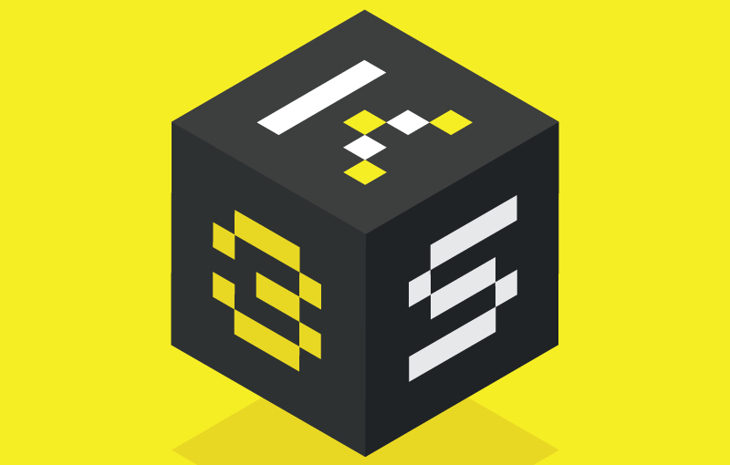

K3S là một phiên bản nhỏ và nhẹ của [Kubernetes](https://manhpt.com/category/kubernetes/) mà bạn có thể sử dụng trên rất nhiều môi trường thiết bị khác nhau. Bài viết này không nhằm mục đích giới thiệu K3S nên các bạn có thể tìm hiểu thêm về K3S tại đây [https://k3s.io/](https://k3s.io/) hoặc [https://github.com/rancher/k3s/blob/master/README.md](https://github.com/rancher/k3s/blob/master/README.md) trước khi đọc tiếp.

Để có thể cài đặt và sử dụng K3S thì các bạn cũng nên tham khảo yêu cầu hệ thống của K3S trước tại: [https://rancher.com/docs/k3s/latest/en/installation/installation-requirements/](https://rancher.com/docs/k3s/latest/en/installation/installation-requirements/). Nếu bạn đã chuẩn bị đầy đủ môi trường theo đúng yêu cầu của K3S thì bắt đầu thôi.

## Cài đặt K3S với tất cả cấu hình mặc định:

```shell
curl -sfL https://get.k3s.io | sh -
```

Sau khi chạy script cài đặt trên thì:

- K3S sẽ được cấu hình để tự động restart sau khi node bị reboot hoặc process bị lỗi hay bị kill.
- Vài công cụ hỗ trợ cũng sẽ được cài đặt đó là: **kubectl, crictl, ctr, k3s-killall.sh,** and **k3s-uninstall.sh.**
- Một file chứa [kubeconfig](https://kubernetes.io/docs/concepts/configuration/organize-cluster-access-kubeconfig/) sẽ được ghi vào **/etc/rancher/k3s/k3s.yaml** và **kubectl** sẽ tự đụng sử dụng file này.

Chú ý:

- Nếu bạn muốn sử dụng K3S với docker thì không nên sử dụng docker được cài đặt qua snap do nó gây ra một vài vấn đề khi chạy K3S. Vui lòng tham khảo: [https://rancher.com/docs/k3s/latest/en/known-issues/](https://rancher.com/docs/k3s/latest/en/known-issues/).

## Cài đặt K3S với custom config

### Không sử dụng Traefik Ingress

```shell
curl -sfL https://get.k3s.io | sh -s - --disable traefik
```

### Không sử dụng cả Traefik Ingress và Local-Path Storage

```shell
curl -sfL https://get.k3s.io | sh -s - --disable traefik,local-storage
```

### Custom range cho NodePort Service

```shell
curl -sfL https://get.k3s.io | sh -s - --kube-apiserver-arg service-node-port-range=2000-32767
```

### Cập nhật TLS cho phép remote kubectl thông qua public IP

```shell
curl -sfL https://get.k3s.io | sh -s - --tls-san=123.123.123.123
```

- **123.123.123.123** - thay bằng public IP của cluster load balancer

## Cập nhật hoặc thay đổi cấu hình K3S

Kubernetes nói chung và K3S nói riêng phát triển tương đối nhanh với cộng đồng lớn. Để cập nhật phiên bản mới hay thay đổi cấu hình cluster thì bạn chỉ cần chạy lại câu lệnh cài đặt với cấu hình mong muốn. Script cài đặt sẽ chạy lại các bước giống như lúc cài đặt.

Việc cập nhật phiên bản mới không nên diễn ra thường xuyên mà nên có kế hoạch trước và cũng nên đợi phiên bản mới chứng minh được tính ổn định rồi bạn mới upgrade cũng không muộn.

## Thêm node cho cluster

Để thêm 1 node mới thì câu lệnh cũng rất đơn giản:

```shell
curl -sfL https://get.k3s.io | K3S_URL=https://<myserver>:6443 K3S_TOKEN=<mynodetoken> sh -
```

- **<myserver\>** - thay bằng IP của master node (nên sử dụng IP LAN)
- **<mynodetoken\>** - thay bằng token của master node được ghi tại **/var/lib/rancher/k3s/server/node-token**

## Xóa cài đặt K3S

Nếu bạn cài đặt k3s sử dụng script thì script để xóa k3s cũng sẽ được cài đặt tự động. Để xóa k3s khỏi một server node:

```shell
/usr/local/bin/k3s-uninstall.sh
```

Để xóa k3s khỏi một agent node:

```shell
/usr/local/bin/k3s-agent-uninstall.sh
```
