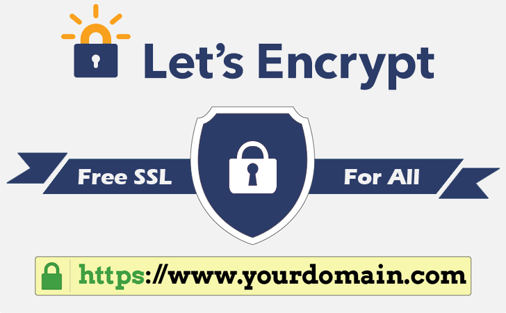
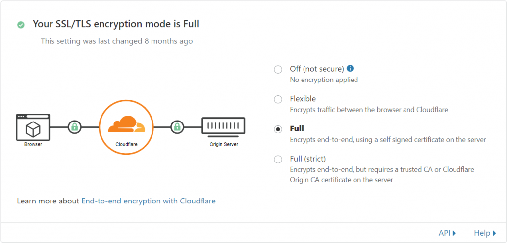
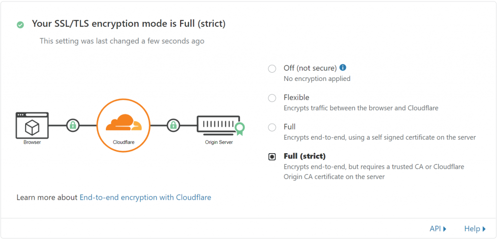

Hướng dẫn cài đặt và cấu hình cert-manager cho website sử dụng ingress-nginx với letsencrypt. Bạn có thể tham khảo tài liệu chính thống về cert-manager tại đây: [https://cert-manager.io/docs/](https://cert-manager.io/docs/).

Kể từ ngày 24/07/2018, Google release Chrome 68 có tính năng đánh dấu các trang web không dùng HTTPS là “Không an toàn” nhằm xây dựng trình duyệt an toàn hơn. Việc này đã diễn ra trong vòng 1 năm. Hiện tại, Microsoft Edge (Chromium) vẫn đang duy trì điều này. Điều này khiến việc triển khai HTTPS cho website của bạn trở thành một yêu cầu bắt buộc.

Trong bài viết này, mình sẽ hướng dẫn cấu hình cert-manager cho [nginx-ingress](https://kubernetes.github.io/ingress-nginx/how-it-works/) để tự động hóa hoàn toàn việc issue và renew chứng chỉ https cho website của bạn hoàn toàn miễn phí. Tất nhiên bài viết này chỉ áp dụng cho hệ thống sử dụng kubernetes. Trong thời điểm viết bài thì mình sử dụng [K3S](https://k3s.io/). Bạn có thể tham khảo cách cài đặt K3S tại [đây](../2020-09-10-cac-thu-thuat-cau-hinh-khi-cai-dat-k3s/index.md).

## Chuẩn bị

- Hạ tầng sử dụng [Kubernetes](/tags/kubernetes/)
- Đã cài đặt nginx-ingress ([https://github.com/kubernetes/ingress-nginx/tree/master/charts/ingress-nginx#install-chart](https://github.com/kubernetes/ingress-nginx/tree/master/charts/ingress-nginx#install-chart))
- Tên miền

## Cài đặt cert-manager

Để cài đặt cert-manager thì bạn chỉ cần làm đúng theo những hướng dẫn từ tài liệu chính hãng tại đây: [https://cert-manager.io/docs/installation/kubernetes/#installing-with-helm](https://cert-manager.io/docs/installation/kubernetes/#installing-with-helm) Tạo namespace `cert-manager`:

```shell
kubectl create namespace cert-manager
```

Tạo một helm release mới:

```shell
# Helm v3+
helm install \
cert-manager jetstack/cert-manager \
--namespace cert-manager \
--version v1.0.3 \
--set installCRDs=true

# Helm v2
helm install \
--name cert-manager \
--namespace cert-manager \
--version v1.0.3 \
jetstack/cert-manager \
--set installCRDs=true
```

## Cấu hình cert-manager ClusterIssuer

Bạn có 2 sự lựa chọn, self signed hoặc letsencrypt. Vui lòng đọc kỹ hướng dẫn trước khi sử dụng 😁.

### Self signed

Sử dụng self signed certificate nếu website của bạn sử dụng kết hợp với [CloudFlare SSL/TLS](https://www.cloudflare.com/ssl/) và sử dụng encryption mode là **Full.**



Tạo một template file `selfsigned.issuer.yaml` với nội dung như sau:

```yaml
apiVersion: cert-manager.io/v1
kind: ClusterIssuer
metadata:
  name: selfsigned
  namespace: cert-manager
spec:
  selfSigned: {}
```

Tạo Issuer từ template trên:

```shell
kubectl --namespace cert-manager apply -f selfsigned.issuer.yaml
```

### Let's Encrypt

Sử dụng Letsencrypt nếu website của bạn public trực tiếp ra internet hoặc sử dụng kết hợp CloudFlare SSL/TLS với encryption mode là **Full (strict)**.



Tạo một template file `letsencrypt-prod.issuer.yaml` với nội dung như sau:

```yaml
apiVersion: cert-manager.io/v1
kind: ClusterIssuer
metadata:
  name: letsencrypt-prod
  namespace: cert-manager
spec:
  acme:
    # The ACME server URL
    server: https://acme-v02.api.letsencrypt.org/directory
    # Email address used for ACME registration
    email: youremail@example.com
    # Name of a secret used to store the ACME account private key
    privateKeySecretRef:
      name: letsencrypt-prod
    # Enable the HTTP-01 challenge provider
    solvers:
      - http01:
          ingress:
            class: nginx
```

Chú ý cập nhật thông tin:

- `youremail@example.com` - thay bằng email của bạn, Let's Encrypt sẽ liên hệ với bạn qua email này

Tạo Issuer từ template trên:

```shell
kubectl --namespace cert-manager apply -f letsencrypt-prod.issuer.yaml
```

## Cấu hình ingress

Do chúng ta sử dụng `kind: ClusterIssuer` nên ingress ở các namespace khác cert-manager vẫn có thể sử dụng được.

```yaml
apiVersion: networking.k8s.io/v1
kind: Ingress
metadata:
  name: test-ingress
  annotations:
    kubernetes.io/ingress.class: nginx
    cert-manager.io/cluster-issuer: selfsigned
spec:
  tls:
    - secretName: test-ingress-tls
      hosts:
        - yourdomain.com
  rules:
    - host: yourdomain.com
      http:
        paths:
          - path:
            backend:
              serviceName: your-service-name
              servicePort: 80
```

Chú ý cập nhật các thông tin:

- `yourdomain.com` - thay bằng domain thật của bạn
- `your-service-name` - thay bằng service name của bạn

Quan trọng nhất là `cert-manager.io/cluster-issuer: selfsigned`, cert-manager sẽ dựa trên các annotations này cùng với thông tin của mỗi Ingress để thực hiện việc issue và renew certificate.

- `cert-manager.io/cluster-issuer` là annotation yêu cầu sử dụng ClusterIssuer
- `selfsigned` là tên của ClusterIssuer được chỉ định
