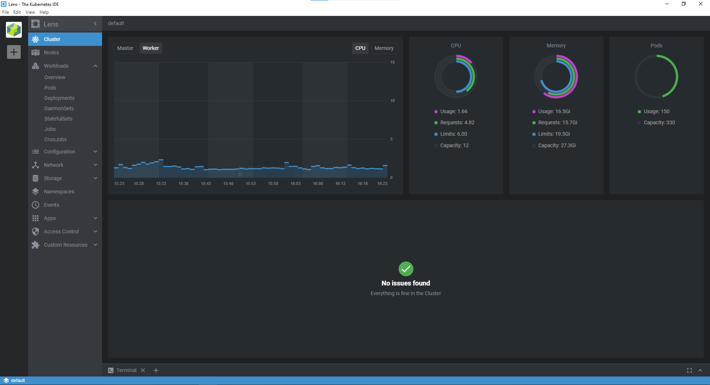

## Lens là một phần mềm nguồn mở cung cấp giao diện thân thiện để làm việc với nhiều kubernetes cluster.

Khi khối lượng công việc được chuyển lên môi trường container (cụ thể là docker) ngày một nhiều, việc quản lý một số lượng lớn container và kết nối giữa chúng trở lên khó khăn hơn. Khi quy mô và độ phức tạp của môi trường container tăng lên vượt quá khả năng quản lý bởi sức người, các nền tảng quản lý cấp phát container như [Kubernetes](/tags/kubernetes/) ngày càng trở nên quan trọng. Tuy nhiên, các nền tảng như vậy cũng đi liền với những thách thức đòi hỏi các thông số, khả năng giám sát và mức độ thân thiện với người dùng để diễn tả mức độ phức tạp của chúng.

## Sử dụng Lens

[Lens](https://k8slens.dev/) - tự xưng Kubernetes IDE - là một công cụ khá hữu ích, hấp dẫn và open source cung cấp khả năng quản lý các kubernetes cluster. Lens có thể kết nối đến các kubernetes cluster sử dụng kubeconfig file, sau đó hiển thị các thông tin về cluster và [objects](https://kubernetes.io/docs/concepts/overview/working-with-objects/kubernetes-objects/) bên trong. Lens cũng có thể kết nối hoặc cài đặt [Prometheus](https://prometheus.io/) stack để cung cấp các thông số về cluster, bao gồm thông tin và tình trạng các node.

Màn hình cluster overview



Tương tự Kubernetes dashboard hoặc Openshift, Lens cung cấp các cập nhật realtime về tình trạng của cluster và thu thập thông số giám sát với Prometheus.

## Cài đặt Lens

Việc cài đặt khá đơn giản và hỗ trợ 3 nền tảng chính: Windows, MacOS, Linux. Có nhiều cách đề cài đặt và đơn giản nhất là tải về và cài đặt từ [https://github.com/lensapp/lens/releases/latest](https://github.com/lensapp/lens/releases/latest). Ngoài ra, cũng có thể cài đặt bằng dòng lệnh với:

### Windows (Chocolatey)

```shell
choco install -y lens
```

### Ubuntu/Linux (Snap)

1. Tải Lens package dành cho Snap.
1. Sau khi tải về, thực hiện lệnh cài đặt snap như sau:

```shell
sudo snap install Lens-{version}.amd64.snap --dangerous --classic
```

Sau đó có thể bắt đầu sử dụng lens bằng cách gõ "lens" vào terminal.

### MacOS

```shell
brew install --cask lens
```

## Lens giúp nhìn ngắm Kubernetes rõ ràng hơn

Kubernetes rất phức tạp và nó có lý do để phải phức tạp. Lens không chỉ giúp giảm bớt rào cản đối với những người mới bắt đầu mà còn giúp những người đã có kinh nghiệm với kubernetes dễ thở hơn. Ngoài cung cấp các thông số cơ bản về cluster, các node, lens còn có thể cung cấp thông tin chi tiết về các objects bên trong. Việc cài đặt hay hiển thị thông số giám sát từ Prometheus stack trở nên cực kỳ dễ dài chỉ với vài lần click chuột.

Ấn tượng hơn nữa, Lens có thể quản lý nhiều cluster cùng lúc và cho phép chuyển đổi giữa các cluster cực dễ dàng chỉ bằng cách nhấn nút. Bài viết có tham khảo và dịch lại từ: https://opensource.com/article/20/6/kubernetes-lens.
