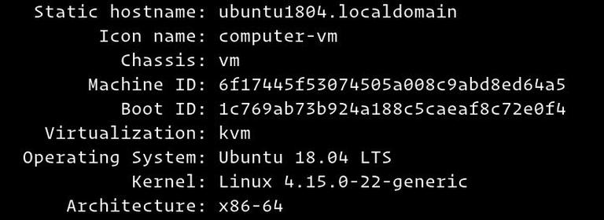

## Vấn đề là...

Bài viết này hướng dẫn nhanh cách thay đổi hostname trên Ubuntu 18.04.

Hostname thường được thiết lập khi bạn cài đặt hệ điều hành hoặc khởi tạo một máy chủ ảo (VM) thì nó sẽ được gán tự động. Cách thay đổi hostname dưới đây có thể áp dụng mà không cần phải khởi động lại hệ điều hành.

Mặc dù hướng dẫn dành cho Ubuntu 18.04 nhưng bạn có thể áp dụng nó cho Ubuntu 16.04 hoặc bất kỳ hệ điều hành nào base trên [Ubuntu](/tags/ubuntu/), VD: Linux Mint, Elementary OS và thậm chí cả [ViettelOS](https://vtcc.vn/production/cyos/).

<!-- truncate -->

## Yêu cầu

Trước khi bắt đầu, hãy đảm bảo bạn đã đăng nhập với user có quyền sudo.

Hostname là một nhãn giúp định danh máy tính/thiết bị trong một không gian mạng (network). Hãy cẩn thận và tránh sử dụng trùng hostname trên 2 máy khác nhau trong cùng mạng.

## Hiển thị hostname hiện tại

```shell
hostnamectl
```

Kết quả của lệnh trên sẽ như sau:  Như trong ảnh trên thì hostname hiện tại là giá trị của `Static hostname`, tức là: `ubuntu1804.localdomain`.

## Thay đổi hostname

### 1. Thay đổi hostname sử dụng `hostnamectl`

Trong Ubuntu 18.04, bạn có thể thay đổi hostname hệ thống và các thiết lập liên quan bằng lệnh hostnamectl. Ví dụ, để thay đổi system hostname thành "manhpt.local", bạn sẽ sử dụng lệnh như sau:

```shell
sudo hostnamectl set-hostname manhpt.local
```

Lệnh `hostnamectl set-hostname` không tạo hay hiển thị ra output gì. Nếu thành không thì sẽ không có gì cả.

### 2. Sửa file `/etc/hosts`

Mở file `/etc/hosts` và thay đổi hostname cũ thành "manhpt.local":

```hosts title=/etc/hosts
127.0.0.1 localhost
127.0.0.1 manhpt.local

# The following lines are desirable for IPv6 capable hosts
::1 localhost ip6-localhost ip6-loopback
ff02::1 ip6-allnodes
ff02::2 ip6-allrouters
```

### 3. Sửa file /etc/cloud/cloud.cfg

Nếu `cloud-init` package được cài đặt thì bạn cần phải sửa file cloud.cfg để đảm bảo hostname mới được lưu sau khi khởi động lại hệ điều hành. `cloud-init` thường được cài đặt mặc định trong hệ thống của AWS, VMWare... và nó được sử dụng để xử lý công đoạn khởi tạo máy ảo (cloud instances).

Để kiểm tra xem cloud-init có được cài đặt hay không thì có thể sử dụng lệnh `ls`:

```shell
ls -l /etc/cloud/cloud.cfg
```

Nếu bạn thấy câu lệnh trả ra kết quả như sau thì không cần làm thêm gì nữa vì `cloud-init` không được cài đặt, tức là có thể không cần tiếp tục đọc bài viết này nữa 🤣:

```shell
ls: cannot access '/etc/cloud/cloud.cfg': No such file or directory
```

Nếu cloud-init được cài đặt thì output sẽ như sau:

```shell
-rw-r--r-- 1 root root 3169 Apr 27 09:30 /etc/cloud/cloud.cfg
```

Sửa file `/etc/cloud/cloud.cfg` với `vim` hoặc `nano` hoặc bất cứ editor nào bạn muốn:

```shell
sudo vim /etc/cloud/cloud.cfg
```

Tìm `preserve_hostname` và đổi giá trị từ `false` thành `true`:

```config title="/etc/cloud/cloud.cfg"
...
# This will cause the set+update hostname module to not operate (if true)
preserve_hostname: true
...
```

Lưu lại thay đổi và tắt editor.

## Kiểm tra thay đổi

Để kiểm tra xem các thay đổi của bạn đã thành công hay chưa thì chỉ cần sử dụng lại lệnh `hostnamectl`.

```shell
hostnamectl
```

Kết quả:

```text
Static hostname: manhpt.local
       Icon name: computer-vm
         Chassis: vm
      Machine ID: 6f17445f53074505a008c9abd8ed64a5
         Boot ID: 1c769ab73b924a188c5caeaf8c72e0f4
  Virtualization: kvm
Operating System: Ubuntu 18.04 LTS
          Kernel: Linux 4.15.0-22-generic
    Architecture: x86-64
```

Bạn sẽ thấy giá trị của `Static hostname` được đổi thành `manhpt.local`. Bạn cũng có thể khởi động lại máy và kiểm tra lại một lần nữa để chắc chắn rằng `cloud-init` được cấu hình chính xác. Bài viết có tham khảo và dịch lịch từ: [How to Change Hostname on Ubuntu 18.04](https://linuxize.com/post/how-to-change-hostname-on-ubuntu-18-04/)
