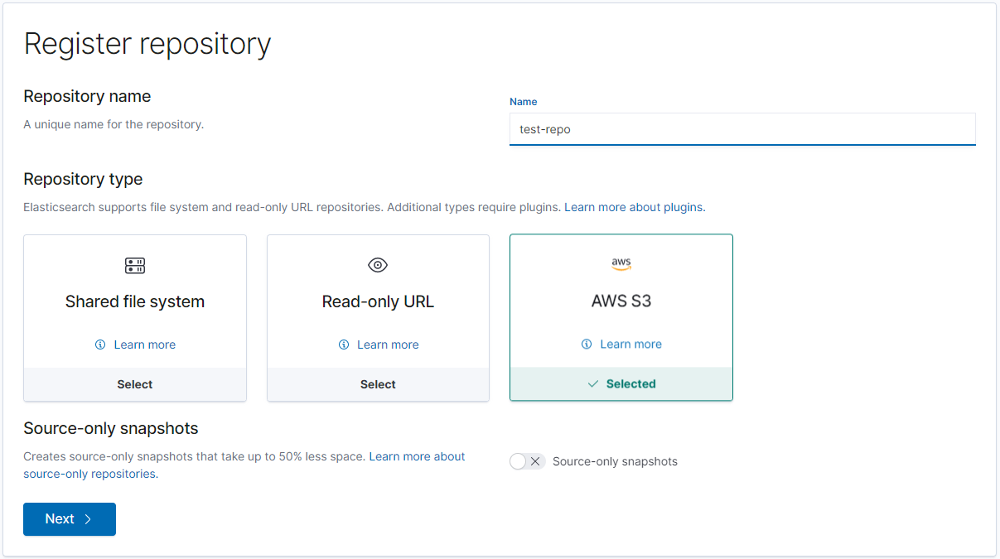
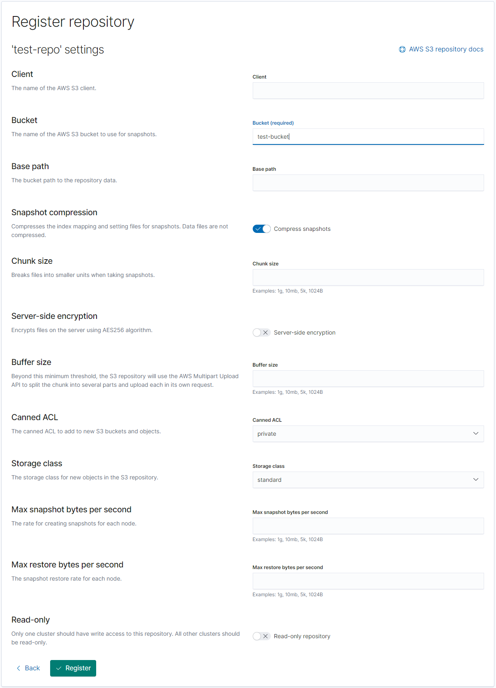
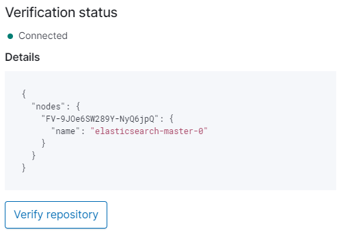
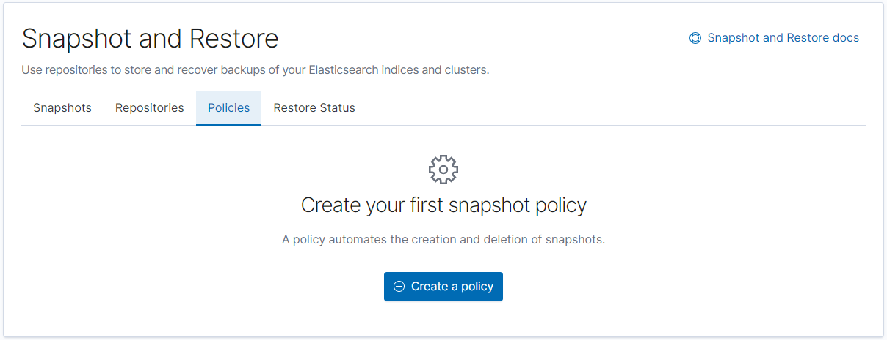
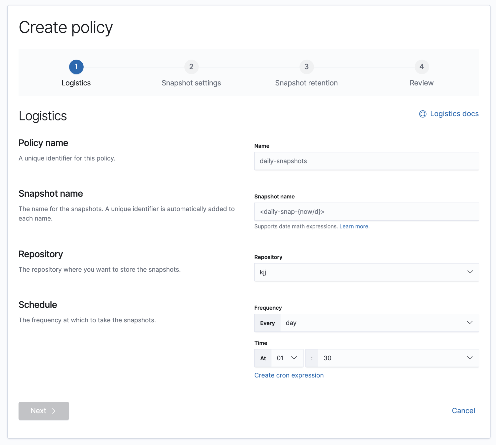
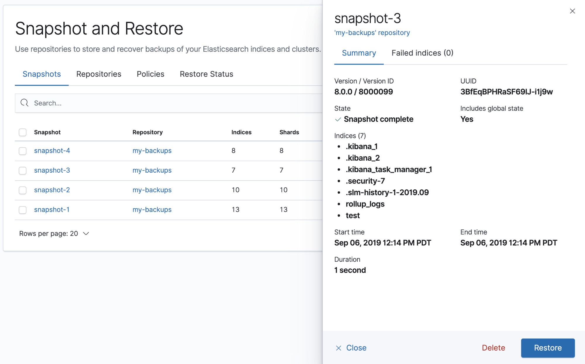
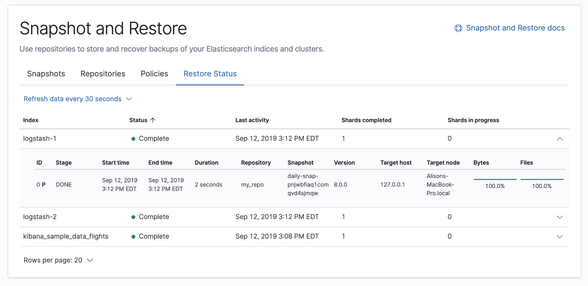

## TL;DR

Nội dung bài viết dành cho elasticsearch và kibana 7.x.

## Vấn đề là...

Ở công ty mình vừa có mấy task devops liên quan đến scaling, clustering Elasticsearch nên viết lại đề phòng sau này cần dùng. Có một task là chuyển dữ liệu từ single-node [Elasticsearch](/tags/elasticsearch/) cũ lên cluster mới. Single-node Elasticsearch cũ nằm trên một máy chủ ảo (VM) riêng và deploy bằng docker-compose. Cluster Elasticsearch mới thì được deploy với [Helm](https://helm.sh/) trong Kubernetes và trên một cụm VM khác.

Có một cách tương đối đơn giản để thực hiện việc này đó là tạo snapshot backup trên single-node cũ và restore snapshot đó trên cluster mới. Sau một hồi google thì mình cũng đã chốt lại được các bước cơ bản sử dụng [Kibana](https://www.elastic.co/kibana):

1.  Cài đặt plugin [repository-s3](https://www.elastic.co/guide/en/elasticsearch/plugins/7.10/repository-s3.html)
2.  Cấu hình AWS S3 credentials cho Elasticsearch
3.  Register một repository với `type` S3 trên single-node Elasticsearch cũ
4.  Tạo `snapshot policy` để tự động hóa việc chụp snapshot và đẩy lên S3 bucket từ Elasticsearch cũ
5.  Register một repository tương tự trên cluster Elasticsearch mới và restore snapshot

Sau đây chúng ta đi vào chi tiết.

## 1. Cài đặt plugin repository-s3 cho Elasticsearch

### 1.1. Rebuild Elasticsearch docker image

Việc cài đặt và kích hoạt plugin đòi hỏi phải khởi động lại cluster Elasticsearch. Do đó, ta không thể cài đặt trực tiếp mà cần phải chỉnh sửa Elasticsearch image. Cụ thể là cần viết một Dockerfile mới để build một image mới từ image elasticsearch mặc định:

```Dockerfile title="Dockerfile"
ARG version=latest
FROM docker.elastic.co/elasticsearch/elasticsearch:${version}
RUN bin/elasticsearch-plugin install --batch repository-s3
```

Gõ lệnh build image như sau:

```shell
# latest version
docker build --tag yourname/elasticsearch .
# specific version
docker build --build-arg version=7.10.1 --tag your-name/elasticsearch:7.10.1 .
# more fancy specific version command
export VERSION=7.10.1 && docker build --build-arg version=$VERSION --tag yourname/elasticsearch:$VERSION -f elasticsearch.dockerfile .
```

Nếu quá trình build image diễn ra tốt đẹp thì ta có thể thấy output như sau:

```log
...
-> Installing repository-s3
-> Downloading repository-s3 from elastic
@@@@@@@@@@@@@@@@@@@@@@@@@@@@@@@@@@@@@@@@@@@@@@@@@@@@@@@@@@@
@     WARNING: plugin requires additional permissions     @
@@@@@@@@@@@@@@@@@@@@@@@@@@@@@@@@@@@@@@@@@@@@@@@@@@@@@@@@@@@
* java.lang.RuntimePermission accessDeclaredMembers
* java.lang.RuntimePermission getClassLoader
* java.lang.reflect.ReflectPermission suppressAccessChecks
* java.net.SocketPermission * connect,resolve
* java.util.PropertyPermission es.allow_insecure_settings read,write
See http://docs.oracle.com/javase/8/docs/technotes/guides/security/permissions.html
for descriptions of what these permissions allow and the associated risks.
-> Installed repository-s3
...
```

Sau khi build image thành công thì push image đó lên đâu đó mà Kubernetes cluster của bạn có thể kéo về được, VD: `docker hub`, `AWS ECR`... Nếu bạn đẩy image lên một private registry thì cần chú ý cấu hình `imagePullSecrets`.

### 1.2. Deploy lại single-node Elasticsearch cũ với image vừa tạo

Thường thì Elasticsearch cũ sẽ khởi chạy lại thành công, nếu phát sinh lỗi gì thì xem log rồi cố gắng google xem vì sao... lol... 😂

2. Cấu hình AWS S3 credentials

---

Để thực hiện bước này thì cần phải `docker exec` (chui) vào trong container của Elasticsearch cũ và gõ:

```shell
elasticsearch-keystore add s3.client.default.access_key
elasticsearch-keystore add s3.client.default.secret_key
```

2 lệnh trên sẽ yêu cầu bạn nhập (prompt) thông tin nhưng khi nhập sẽ không nhìn thấy gì đâu, cứ copy paste rồi enter. Đại loại bạn sẽ nhìn thấy màn hình hiển thị như sau:

```shell
[root@xxxxxx bin]# elasticsearch-keystore add s3.client.default.access_key
Enter value for s3.client.default.access_key:
[root@xxxxxx bin]# elasticsearch-keystore add s3.client.default.secret_key
Enter value for s3.client.default.secret_key:
```

Để có `access_key` và `secret_key` từ một IAM user có quyền đọc ghi S3 bucket, truy cập [AWS IAM Users](https://console.aws.amazon.com/iam/home#/users) > chọn user có quyền trên dịch vụ S3 > Security credentials > Create access key.

Nhập credentials xong thì khởi động lại single-node Elasticsearch. Sau khi khởi động lại thành công thì mở Kibana Dev Tools để `reload_secure_settings`:

```shell
POST _nodes/reload_secure_settings
{}
```

## 3. Register một repository với `type` S3

### 3.1. Nhập tên và chọn kiểu là S3 --> nhấn Next



### 3.2. Nhập tên bucket --> nhấn Register

Bucket cần được khởi tạo trước trên [AWS S3 console](https://s3.console.aws.amazon.com/s3/home).



### 3.3. (optional) Verify repo

Sau khi register thành công, màn hình sẽ hiển thị thông tin repo vừa được tạo. Bạn sẽ nhìn thấy nút "Verify repository" ở panel chi tiết phía bên phải, sau khi nhấn nút này thì Kibana sẽ hiển thị "Verification status" là connected.



Nếu status là "Not connected" thì thông tin lỗi cũng sẽ được hiển thị trong mục Details.

## 4. Tạo Policy để tự động hóa tạo và xóa snapshot

Ta chỉ cần chuyển sang tab policy, nằm ngay bên cạnh repository. Nhấn "Create a policy".



Các bước tạo policy khá đơn giản và trực quan trên giao diện của Kibana. Bạn có thể tham khảo tài liệu chính hãng tại đây: [https://www.elastic.co/guide/en/kibana/current/snapshot-repositories.html#kib-snapshot-policy](https://www.elastic.co/guide/en/kibana/current/snapshot-repositories.html#kib-snapshot-policy).



## 5. Restore snapshot trên cluster Elasticsearch mới

### 5.1. Lặp lại các bước từ 1.2 đến 3.3 với cluster Elasticsearch mới

Trong scope của bài viết này thì ta chỉ cần restore snapshot trên cluster mới nên không cần tạo policy để backup.

### 5.2. Restore snapshot

Vào tab Snapshots, chọn snapshot mới nhất và nhấn Restore.



Sau khi quá trình restore bắt đầu thì bạn có thể theo dõi trạng thái tại tab "Restore Status".



Thế là xong rồi. Cảm ơn bạn đã đọc đến đây! 😆
