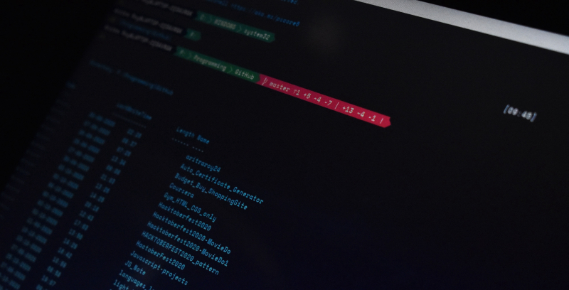
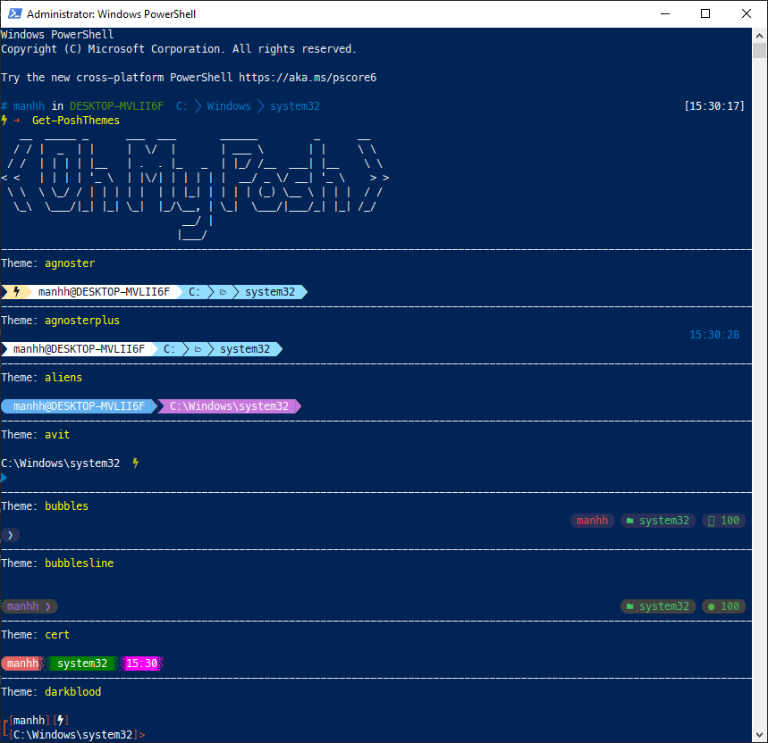
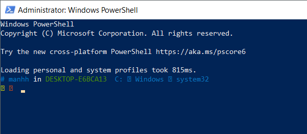
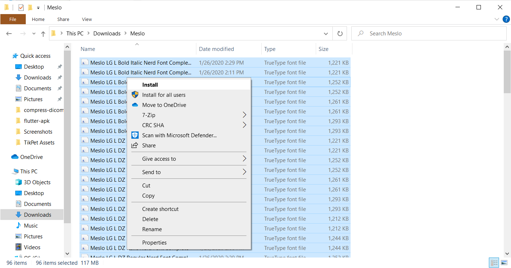

## TL;DR

Bài viết hướng dẫn cách cài đặt Oh-My-Posh vào Powershell.

Là một developer thì chắc hẳn bạn đã sử dụng shell/bash trên linux hay macos. Mà đã sử dụng shell/bash thì chắc cũng sẽ biết đến [Oh My Zsh](https://ohmyz.sh/) - một công cụ huyền thoại cho những ai yêu dòng lệnh (command line).

Một developer xuất thân MacOS như mình khi chuyển môi trường sang Windows đã luôn cảm thấy CMD hay Powershell rất tù khi phải làm việc chéo cánh với các server Linux. Ngoài ra khi làm việc với [git](/tags/git/) command thì mình cũng bị phụ thuộc vào Git Bash để nhận được gợi ý khi gõ lệnh.

Sau một thời giản dài sống chung với lũ hồi tìm hiểu thì cuối cùng cũng tìm ra được chân ái - [Oh My Posh](https://ohmyposh.dev/). Oh My Posh giúp powershell trở nên đầy màu sắc đi kèm với những thông tin hữu ích liên quan đến project hiện tại và cả git nữa, quá ngon rồi 😁 mlem mlem...



Giao diện powershell sau khi được cài đặt OhMyPosh và danh sách themes để bạn chọn

## 1. Cài đặt Oh-My-Posh

Tài liệu chính chủ của Oh My Posh cũng đã có hướng dẫn rất đầy đủ rồi nhưng mình vẫn tóm tắt lại theo các bước cài đặt bằng Powershell cho tiện. Để cài đặt thì bạn mở Powershell với quyền Admin lên và:

```powershell
Set-ExecutionPolicy RemoteSigned
Install-Module oh-my-posh -Scope CurrentUser
```

## 2. Sử dụng Oh-My-Posh

Để bắt đầu sử dụng Oh My Posh ngay trong powershell thì ta chỉ cần gõ lệnh sau:

```powershell
Set-PoshPrompt -Theme honukai
```

Nhưng mỗi lần muốn sử dụng lại phải gõ lệnh thì bất tiện vl 🙄. Để đảm bảo mỗi lần mở Powershell lên mà Oh My Posh cũng sẵn sàng vào việc luôn thì cần sửa powershell profile (giống như cách ta update `~/.bash_profile` ở linux/macos vậy):

```powershel
notepad $PROFILE
# hoặc
notepad C:\Users\$env:USERNAME\Documents\WindowsPowerShell\Microsoft.PowerShell_profile.ps1
```

Kết quả của lệnh trên là để cập nhật nội dung file `Microsoft.PowerShell_profile.ps1`, ta chỉ cần thêm nội dung như sau vào:

```powershell
Set-PoshPrompt -Theme honukai
```

Xong bước này thì chỉ cần khởi động lại Powershell là bạn đã có thể sử dụng Oh My Posh rồi, nhưng nhìn nó sẽ sai sai như thế này:



## 3. Cài đặt font hỗ trợ Oh-My-Posh

Cái "sai sai" ở đây là lỗi font chữ nên bạn có thể nhìn thấy khá nhiều ký tự ⍰. Tài liệu của Oh My Posh có hướng dẫn rất rõ ràng là các bạn nên sử dụng Nerd Fonts ([tham khảo](https://ohmyposh.dev/docs/fonts#nerd-fonts)), và họ khuyến khích sử dụng font [Meslo LGM NF](https://ohmyposh.dev/docs/config-fonts#nerd-fonts) ([tải về tại đây](https://ohmyposh.dev/docs/config-fonts#nerd-fonts)).

Bạn chỉ cần tải `Meslo.zip` về rồi giải nén ra rồi cài đặt.



Chưa xong, cần phải thay font cho Powershell nữa, **click chuột phải vào thanh menu của cửa sổ Powershell > Properties > tab Fonts**.


Chọn font `MesloLGM NF` như ảnh trên rồi click **OK**. Thế là xong rồi, khởi động lại Powershell để hưởng thụ thành quả thôi. Max xịn sò 😎.

## 4. Thay đổi giao diện cho Oh-My-Posh (Optional)

Nếu bạn để ý một chút khi dùng Oh My Zsh thì nó sử dụng theme mặc định là `robbyrussel`. Đương nhiên là Oh My Zsh cũng cung cấp lựa chọn này cho bạn nếu bạn muốn có được cảm nhận tương đồng nhất có thể như với khi sử dụng bash trên linux/macos.

Như ở bước 2 mình có đặt sẵn câu lệnh `Set-PoshPrompt -Theme honukai`, có nghĩa là mình chọn sẵn theme honukai - theme này thì text không có màu nền nên khi mình sử dụng Powershell với VScode hay Jetbrains IDEs đều cho cảm giác dễ chịu.

Bạn có thể dùng lệnh `Get-PoshThemes` để liệt kê và chọn trong danh sách các themes có sẵn.

```powershell
Get-PoshThemes
```
