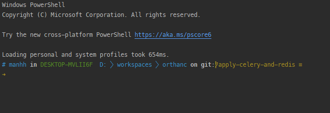
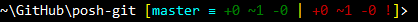

Post-git là một module Powershell cho phép tích hợp Git với Powershell hỗ trợ git autocomplete. Posh-git có vài tính năng quan trọng như:

- Cung cấp thông tin cơ bản về repository hiện tại trên dòng lệnh
- Tự động gợi ý khi gõ lệnh (git autocomplete)

Giao diện Powershell sau khi tích hợp posh-git:



Trong một bài viết trước, mình có hướng dẫn cách [cài đặt và tích hợp oh-my-posh](https://manhpt.com/2021/03/30/su-dung-oh-my-posh-de-powershell-tro-nen-hap-dan-hon/) cho Powershell để cải thiện trải nghiệm làm việc. Trong bài viết này mình sẽ giới thiệu [posh-git](https://github.com/dahlbyk/posh-git).

## 1. Cài đặt posh-git

Trước khi cài đặt thì bạn cũng nên xem qua yêu cầu của posh-git trước tại [đây](https://github.com/dahlbyk/posh-git#prerequisites).

Cài đặt qua Powershell

```powershell
Install-Module posh-git -Scope CurrentUser
```

Cài đặt qua Chocolatey

```powershell
choco install poshgit
```

Cài đặt qua Scoop

```powershell
scoop install posh-git
```

## 2. Tích hợp post-git để sử dụng tính năng git autocomplete

Để tích hợp posh-git vào Powershell thì ta cần phải thực hiện bước `Import-Module`. Cách nhanh nhất để làm việc này chỉ là một dòng lệnh:

```powershell
Add-PoshGitToProfile
```

Giao diện posh-git trên Powershell cơ bản:


Nếu thành công thì chỉ cần mở lại Powershell là đã có thể sử dụng posh-git với Powershell rồi. Nếu lệnh trên báo lỗi thì ta có thể làm thủ công bằng cách:

```powershell
notepad $PROFILE
```

Cập nhật nội dung của `$PROFILE`file và thêm dòng`Import-Module posh-git`vào.

Nội dung file`$PROFILE` (`C:\Users\$env:USERNAME\Documents\WindowsPowerShell\Microsoft.PowerShell_profile.ps1`) của bạn có thể sẽ như sau:

```powershell
Import-Module oh-my-posh Import-Module posh-git Set-PoshPrompt -Theme honukai
```

Lưu lại và khởi động lại Powershell để hưởng thụ thành quả nhé.

Giao diện posh-git và oh-my-posh trên Powershell:


Để nhận được gợi ý khi gõ lệnh với git thì bạn chỉ cần nhấn phím "Tab" là được.
