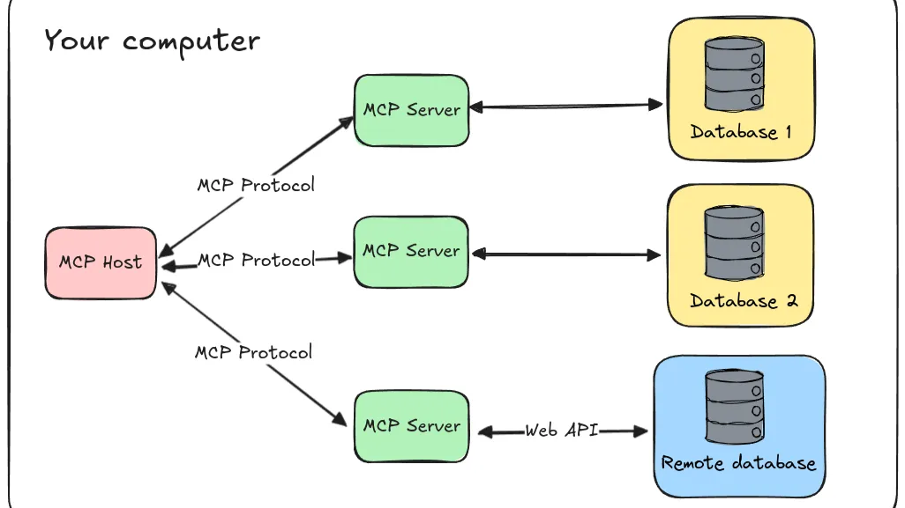

## Tóm tắt khái niệm về MCP theo bài viết từ Anthropic

**Model Context Protocol (MCP)** là một giao thức chuẩn mở được Anthropic giới thiệu vào ngày 26/11/2024, nhằm mục đích kết nối các mô hình ngôn ngữ lớn (LLM) với dữ liệu và công cụ bên ngoài một cách liền mạch. Dưới đây là khái niệm cốt lõi của MCP dựa trên bài viết:

<!-- truncate -->

- **Mục đích**: MCP được thiết kế để đơn giản hóa việc tích hợp AI với các nguồn dữ liệu và ứng dụng thực tế, giúp các mô hình AI truy cập thông tin theo thời gian thực, thực hiện hành động, và cung cấp phản hồi chính xác hơn dựa trên ngữ cảnh cụ thể.
- **Cấu trúc**: Đây là một kiến trúc client-server, trong đó MCP đóng vai trò như một "ngôn ngữ chung" cho phép các ứng dụng AI (client) giao tiếp với các máy chủ MCP (server) chứa dữ liệu hoặc công cụ. Điều này loại bỏ nhu cầu xây dựng các kết nối tùy chỉnh cho từng nguồn dữ liệu.
- **Tính năng chính**:
  - **Truy cập dữ liệu**: Cho phép AI lấy thông tin từ các hệ thống như Google Drive, Slack, GitHub, hoặc cơ sở dữ liệu nội bộ.
  - **Thực hiện hành động**: AI có thể thực hiện các tác vụ như gửi tin nhắn, truy vấn cơ sở dữ liệu, hoặc tìm kiếm web thông qua các công cụ được chuẩn hóa.
  - **Mở rộng dễ dàng**: Với tính chất mã nguồn mở, MCP hỗ trợ cộng đồng phát triển thêm các máy chủ MCP cho nhiều hệ thống khác nhau.
- **Ứng dụng thực tế**: MCP được tích hợp trong ứng dụng Claude Desktop của Anthropic, cho phép AI truy cập tệp cục bộ, ứng dụng, và dịch vụ một cách an toàn, nâng cao khả năng hỗ trợ người dùng trong công việc hàng ngày.
- **Lợi ích**: Bằng cách cung cấp một tiêu chuẩn thống nhất, MCP giảm bớt sự phức tạp trong phát triển AI, tăng cường khả năng tương tác giữa các hệ thống, và thúc đẩy sự sáng tạo trong việc xây dựng các ứng dụng AI thông minh hơn.

Tóm lại, MCP là một giao thức mang tính cách mạng, giúp kết nối AI với thế giới thực một cách hiệu quả và có thể mở rộng, mở ra tiềm năng cho các trợ lý AI thông minh hơn, linh hoạt hơn trong tương lai.

Nguồn: [Anthropic](https://www.anthropic.com/news/model-context-protocol)