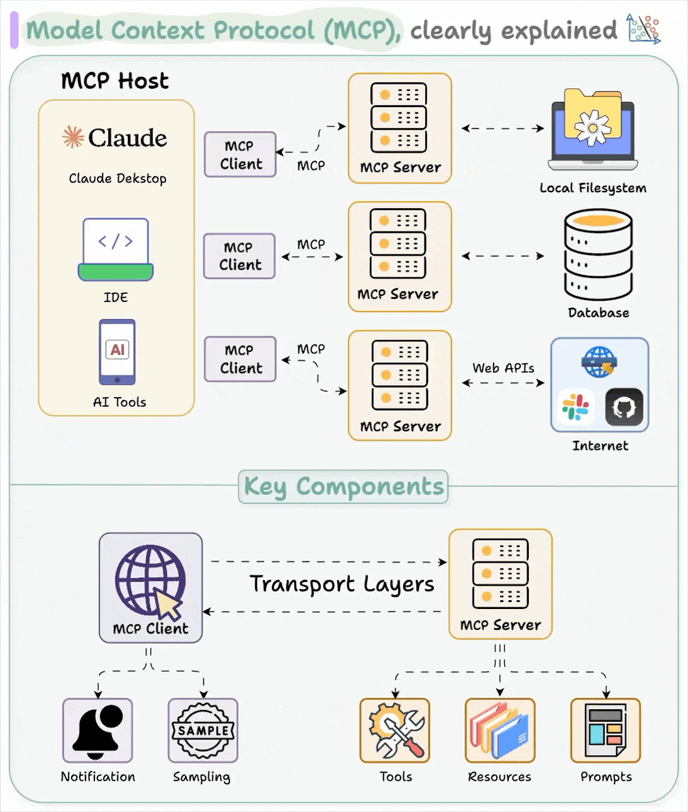

Bài viết trên blog LangChain thảo luận về Model Context Protocol (MCP) – một giao thức đang thu hút sự chú ý trong cộng đồng AI – qua cuộc tranh luận giữa Harrison Chase (CEO LangChain) và Nuno Campos (Trưởng nhóm LangGraph). Nội dung chính xoay quanh việc MCP có thực sự hữu ích hay chỉ là một xu hướng nhất thời.

<!-- truncate -->

## Quan điểm của [Harrison Chase (LangChain CEO)](https://www.linkedin.com/in/harrison-chase-961287118/)

MCP hữu ích trong việc tích hợp công cụ vào các agent mà người dùng không kiểm soát trực tiếp (ví dụ: Claude Desktop, Cursor). Ông cho rằng MCP phù hợp với người dùng không phải lập trình viên, giúp họ dễ dàng thêm công cụ vào agent, dù hình thức hiện tại của MCP còn phức tạp và cần cải thiện (như cài đặt một cú nhấp chuột).

## Quan điểm của Nuno Campos (Trưởng nhóm LangGraph)

MCP quá phức tạp, khó triển khai và không phù hợp để mở rộng trên server do thiếu thiết kế không trạng thái. Ông nghi ngờ hiệu quả của MCP khi các mô hình hiện tại chỉ gọi đúng công cụ khoảng 50% thời gian, và kỳ vọng của người dùng sẽ tăng cùng với sự cải thiện của công nghệ.

## Điểm chung

Cả hai đồng ý rằng MCP không phải giải pháp tối ưu cho mọi trường hợp, nhưng có tiềm năng nếu được đơn giản hóa và cải thiện.

## Kết luận

Bài viết không đưa ra kết luận dứt khoát rằng MCP là "xu hướng thoáng qua" hay "tiêu chuẩn tương lai". Thay vào đó, nó nhấn mạnh rằng giá trị của MCP phụ thuộc vào cách nó phát triển: nếu đơn giản hơn, dễ triển khai hơn và hỗ trợ tốt hơn cho các agent không do lập trình viên phát triển, MCP có thể trở thành một công cụ quan trọng. Tuy nhiên, với những hạn chế hiện tại về độ phức tạp và hiệu suất, MCP vẫn cần chứng minh tính thực tiễn để vượt qua giai đoạn "hype" ban đầu.

Giai đoạn "hype" có ý nghĩa là thời kỳ mà một công nghệ hoặc ý tưởng mới nhận được rất nhiều sự chú ý và kỳ vọng, nhưng chưa được chứng minh tính thực tiễn và hiệu quả trong thực tế.

Nguồn: [LangChain Blog](https://blog.langchain.dev/mcp-fad-or-fixture/)
