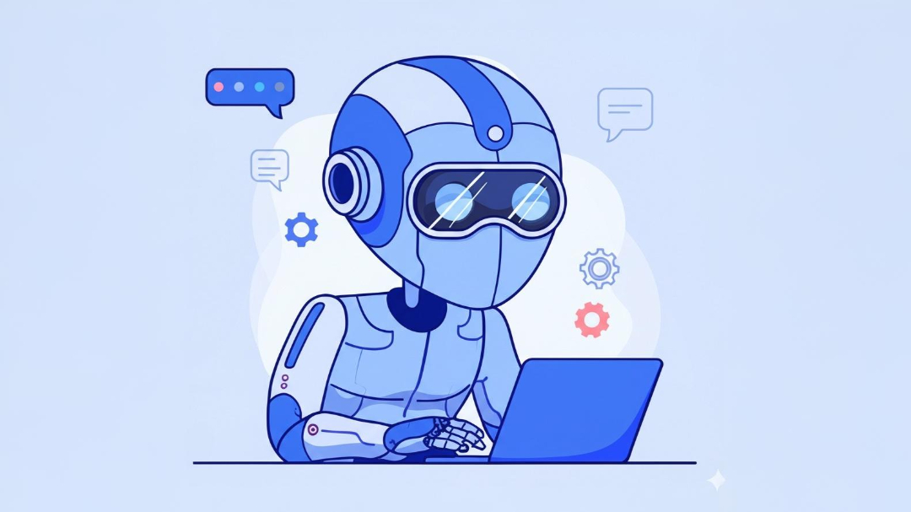

**AI Agent Cá Nhân Hóa: Bước Tiến Tới Tương Lai Nơi Mỗi Người Có Một "Trợ Lý Số" Riêng**

Trong kỷ nguyên số hóa, trí tuệ nhân tạo (AI) không còn là khái niệm xa vời mà đã len lỏi vào mọi ngóc ngách của cuộc sống. Từ những chatbot trả lời tự động đến các hệ thống gợi ý phức tạp, AI đang dần thay đổi cách chúng ta làm việc và tương tác. Một trong những xu hướng hấp dẫn và đầy hứa hẹn nhất hiện nay chính là sự trỗi dậy của **AI Agent cá nhân hóa** – những trợ lý ảo thông minh được thiết kế riêng biệt, hoạt động như một "phiên bản số" thay mặt chúng ta thực hiện các tác vụ.

**Tại Sao Lại Là AI Agent Cá Nhân Hóa?**

Các trợ lý ảo thế hệ đầu như Siri, Alexa hay Google Assistant đã mang đến những tiện ích nhất định, nhưng chúng thường mang tính "đại chúng", phục vụ nhu cầu chung của số đông. AI Agent cá nhân hóa đi xa hơn thế. Chúng được kỳ vọng sẽ:

1.  **Thấu hiểu sâu sắc người dùng:** Học hỏi từ thói quen, sở thích, lịch trình, phong cách giao tiếp và cả những mối quan tâm đặc biệt của bạn.
2.  **Hoạt động chủ động:** Không chỉ phản hồi yêu cầu, mà còn có thể dự đoán nhu cầu, đưa ra gợi ý phù hợp và tự động thực hiện các tác vụ được ủy quyền.
3.  **Tương tác ngữ cảnh:** Hiểu rõ ngữ cảnh công việc, cuộc sống cá nhân của bạn để đưa ra những hỗ trợ chính xác và hiệu quả nhất.
4.  **Đại diện cho bạn:** Thay mặt bạn soạn thảo email theo đúng giọng văn, tóm tắt báo cáo dựa trên những điểm bạn quan tâm, sắp xếp lịch trình phức tạp, hay thậm chí là đặt vé máy bay, khách sạn theo đúng tiêu chuẩn bạn thường chọn.

Viễn cảnh mỗi người sở hữu một AI Agent riêng, hoạt động như một trợ lý đắc lực, hiểu rõ chúng ta hơn bất kỳ ai và giúp tối ưu hóa công việc, cuộc sống không còn là khoa học viễn tưởng.

**Thách Thức Tích Hợp: Làm Sao Để AI Agent "Bước Ra Thế Giới Thực"?**

Một AI Agent, dù thông minh đến đâu, cũng sẽ trở nên hạn chế nếu chỉ tồn tại trong "không gian số" của riêng nó. Để thực sự hữu ích, nó cần phải **tương tác và tích hợp** được với vô số hệ thống, ứng dụng và nguồn dữ liệu mà chúng ta sử dụng hàng ngày: email, lịch, ứng dụng nhắn tin, cơ sở dữ liệu công việc, các trang web đặt dịch vụ, v.v.

Đây chính là lúc bài toán tích hợp trở nên phức tạp. Làm thế nào để AI Agent có thể:

* **Hiểu** được cách sử dụng một công cụ hoặc API cụ thể?
* **Truy cập** dữ liệu một cách an toàn và bảo mật?
* **Thực thi** hành động trên các hệ thống bên ngoài một cách đáng tin cậy?
* **Mở rộng** khả năng bằng việc thêm các công cụ mới một cách dễ dàng?

**MCP (Model Context Protocol) và Phát Triển Tools: Chìa Khóa Cho Khả Năng Tích Hợp**

Để giải quyết thách thức này, các giao thức và kiến trúc mới đang được phát triển, và **Model Context Protocol (MCP)** nổi lên như một hướng tiếp cận tiềm năng (lưu ý: MCP có thể là một thuật ngữ cụ thể hoặc đại diện cho một lớp các giao thức tương tự nhằm chuẩn hóa cách AI model tương tác với môi trường bên ngoài và công cụ).

Ý tưởng cốt lõi đằng sau các giao thức như MCP là **chuẩn hóa cách AI Agent "nhìn thấy" và "sử dụng" các công cụ (tools) bên ngoài.** Thay vì phải lập trình riêng lẻ cho từng tương tác, MCP (hoặc các giao thức tương tự) cung cấp một bộ quy tắc chung:

1.  **Định nghĩa Tool:** Các nhà phát triển có thể "mô tả" một công cụ cho AI Agent biết: tên công cụ là gì, chức năng của nó, cần những thông tin đầu vào (input) nào, và sẽ trả về kết quả (output) ra sao. Ví dụ: một tool `send_email` cần `recipient_address`, `subject`, `body` và sẽ trả về trạng thái `sent` hoặc `failed`.
2.  **Giao tiếp Chuẩn hóa:** AI Agent, khi cần thực hiện một tác vụ không thuộc khả năng nội tại (như gửi email), sẽ xác định được tool phù hợp dựa trên mô tả, sau đó tạo một yêu cầu theo đúng định dạng chuẩn của giao thức (ví dụ: MCP) để gọi tool đó.
3.  **Thực Thi và Phản Hồi:** Hệ thống trung gian (hoặc chính môi trường chứa agent) nhận yêu cầu, thực thi tool với các tham số được cung cấp, và trả kết quả về cho AI Agent theo định dạng chuẩn.

**Lợi ích của việc sử dụng MCP (và các giao thức tương tự) để phát triển tools cho AI Agent:**

* **Tăng cường khả năng tích hợp:** Dễ dàng kết nối AI Agent với vô số ứng dụng và dịch vụ hiện có thông qua các "tools" được chuẩn hóa.
* **Mở rộng linh hoạt:** Việc thêm các khả năng mới cho AI Agent trở nên đơn giản hơn bằng cách phát triển và đăng ký các tools mới tuân thủ giao thức.
* **Tái sử dụng và Chia sẻ:** Các tools được phát triển có thể được tái sử dụng cho nhiều AI Agent khác nhau.
* **Bảo mật và Kiểm soát:** Giao thức chuẩn hóa giúp quản lý quyền truy cập và kiểm soát việc sử dụng các tools một cách chặt chẽ hơn.
* **Đẩy nhanh phát triển:** Các nhà phát triển có thể tập trung vào việc xây dựng logic của tool thay vì lo lắng về cách AI Agent sẽ gọi nó.

Nhờ có MCP và hệ sinh thái các tools được xây dựng xung quanh nó, AI Agent cá nhân hóa có thể thực sự "vươn tay" ra thế giới thực, truy cập thông tin từ lịch của bạn, gửi email thay bạn, phân tích dữ liệu từ bảng tính, đặt lịch họp qua ứng dụng công ty, và thực hiện hàng ngàn tác vụ khác một cách liền mạch.

**Hướng Tới Tương Lai**

Xu hướng AI Agent cá nhân hóa đang phát triển mạnh mẽ. Việc kết hợp sức mạnh của các mô hình ngôn ngữ lớn (LLMs) với khả năng tích hợp thông qua các giao thức như MCP và hệ sinh thái tools phong phú đang mở ra một kỷ nguyên mới cho trợ lý ảo.

Chúng ta đang ngày càng tiến gần hơn đến viễn cảnh mỗi người đều có một AI Agent đồng hành, một "bộ não thứ hai" không chỉ thông minh mà còn có khả năng hành động, giúp chúng ta điều hướng thế giới số phức tạp và giải phóng thời gian cho những điều thực sự quan trọng. Tất nhiên, những thách thức về bảo mật, quyền riêng tư, và đạo đức AI vẫn cần được giải quyết một cách cẩn trọng. Nhưng không thể phủ nhận, tương lai của trợ lý cá nhân đang đến rất gần, và nó được cá nhân hóa sâu sắc hơn bao giờ hết.
