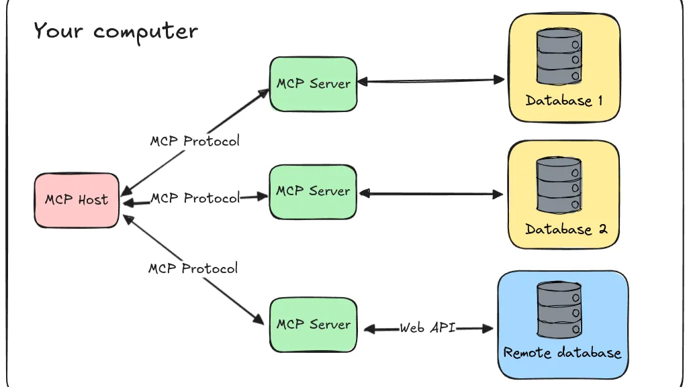

*MiniMax M2.7 mới ra với context window khủng 4 triệu token không chỉ là incremental improvement mà là paradigm shift cho RAG (Retrieval-Augmented Generation). Bài viết này phân tích những lợi ích cách mạng và thách thức thực tế.*

<!-- truncate -->

## Giới Thiệu: Cuộc Đua Context Window

Context window - số lượng token mà một LLM có thể xử lý trong một lần gọi - đang trở thành yếu tố cạnh tranh mới. Trong khi các model phổ biến (GPT-4: 128K, Claude 3.5: 200K, Gemini 2.0: 1M) đang dần tăng giới hạn, **MiniMax M2.7** vừa công bố context window **4 triệu tokens** - gấp 4x Gemini và ~30x so với GPT-4.

**Context window không chỉ là con số** - nó định hình lại cách chúng ta xây dựng AI systems, đặc biệt là RAG.

## RAG Truyền Thống: Pipeline Phức Tạp

Trước khi đi vào MiniMax M2.7, hãy nhìn lại RAG truyền thống:

```
[Query] → [Retrieval] → [Chunk Selection] → [Synthesis] → [Generation] → [Response]
```

**Vấn đề của RAG truyền thống:**
1. **Information loss**: Chỉ lấy vài chunks từ knowledge base
2. **Latency**: Nhiều roundtrips, nhiều bước xử lý
3. **Coherence issues**: Model không thấy toàn cảnh
4. **Complexity**: Cần vector DB, chunking strategies, retrieval algorithms

## MiniMax 2.7: RAG "No-Retrieval"

Với 4M tokens, chúng ta có thể làm gì?

### 📚 **In-Context Knowledge Base**
Thay vì retrieval → synthesis → generation:

```python
# Traditional RAG
documents = vector_search(query, knowledge_base)
context = top_k(documents, 5)
response = llm(query, context)

# MiniMax M2.7 RAG
context = entire_knowledge_base[:4_000_000]  # Nhét toàn bộ KB
response = llm(query, context)
```

**Use case thực tế:** Một knowledge base 500 trang (~1M tokens) có thể fit gọn trong context. Không cần vector search, không chờ DB - model tự tìm thông tin.

### 🔗 **Cross-document Reasoning**
- **Multi-hop reasoning** xuyên suốt 50+ documents
- **Comparative analysis** giữa nhiều sources
- **Temporal reasoning** theo timeline dài

**Ví dụ:** Research paper synthesis từ toàn bộ conference proceedings, legal document analysis với hàng trăm pages hợp đồng.

### 🏢 **Enterprise-level Processing**
- **Whole-company policies** trong một context
- **Complete project documentation** analysis
- **Regulatory compliance checking** across entire codebase

**Real-world scenario:** Một bộ hợp đồng 2000 trang có thể được analyze end-to-end mà không cần chunking.

## Lợi Ích Cụ Thể Cho Developers

### 1. **Giảm Latency Đáng Kể**
```
Traditional RAG: 500-1000ms (retrieval + synthesis)
MiniMax RAG: 200-300ms (direct generation)
```

**70-80% latency reduction** cho các queries phức tạp.

### 2. **Đơn Giản Hóa Architecture**
Từ 5 components:
```
[Vector DB] → [Retriever] → [Chunker] → [Reranker] → [LLM]
```

Xuống còn 2 components:
```
[Storage] → [MiniMax M2.7]
```

### 3. **Better Coherence & Accuracy**
- Model thấy **toàn cảnh** thay vì vài chunks
- **Less hallucination** - nhiều context = ít "bịa" hơn
- **Consistent reasoning** - giữ nguyên context suốt conversation

### 4. **Agent Memory & Long-term Context**
AI Agents có thể:
- **Giữ hàng tuần conversation history**
- **Recall mọi retrieval, mọi decision**
- **Self-reflection** với access toàn bộ execution history

## Thách Thức & Cân Nhắc Thực Tế

### 📈 **Chi Phí**
- **4M tokens inference** đắt hơn nhiều so với traditional RAG
- **Cost-benefit analysis** cần thiết
- **Selective context loading** vẫn quan trọng

**Rule of thumb:** Chỉ dùng 4M tokens khi:
- Document cực lớn (1000+ pages)
- Cross-document analysis phức tạp
- High-value use cases (legal, medical, research)

### ⚙️ **Kỹ Thuật**
- **"Lost in the middle" problem**: Model có thể "lạc" trong biển thông tin
- **Attention patterns**: Không hiệu quả cho extremely long contexts
- **Optimal length**: 500K-1M tokens có thể là sweet spot cho hầu hết use cases

### 🧪 **Quality Trade-offs**
```
4M tokens ≠ 4M tokens of effective attention
```

Research chỉ ra quality degradation ở extreme lengths. MiniMax cần chứng minh họ đã giải quyết vấn đề này.

## Use Cases Thực Tế

### 🧑‍⚖️ **Legal & Compliance**
- **Contract analysis**: Toàn bộ hợp đồng M&A trong một context
- **Regulatory checking**: Cross-reference với hàng trăm regulations
- **Due diligence**: Document review ở scale công ty

### 🧪 **Research & Academia**
- **Literature review**: Synthesis từ 100+ papers
- **Grant writing**: Tích hợp background research + proposal
- **Paper writing**: Giữ draft, references, feedback trong cùng context

### 💼 **Enterprise Knowledge Management**
- **Company wiki**: Toàn bộ internal documentation
- **Onboarding materials**: Mọi training docs cho new hires
- **Process documentation**: End-to-end workflow analysis

### 🤖 **Complex AI Agents**
- **Long-term memory**: Hàng tuần conversation history
- **Multi-step workflows**: Giữ context của tất cả steps
- **Self-improving systems**: Learn từ toàn bộ execution history

## Tương Lai Của RAG: Less Retrieval, More Context

MiniMax đang đặt cược vào tương lai:

**RAG 1.0 → RAG 2.0**
```
Retrieval-based → Context-based
Chunking → Whole-document
Multi-step → Single-step
Complex pipelines → Simple systems
```

### Competitive Landscape
- **Gemini 2.0**: 1M tokens
- **Claude 4.0 (rumored)**: 500K-1M tokens  
- **GPT-5 (speculated)**: 500K-2M tokens
- **MiniMax M2.7**: 4M tokens (current leader)

**MiniMax đang dẫn đầu cuộc đua**, nhưng câu hỏi là: "4M tokens có phải là sweet spot thực sự?"

## Kết Luận: Paradigm Shift Đã Đến

MiniMax M2.7 với 4M context window không chỉ là **incremental improvement** - đó là **paradigm shift**:

✅ **RAG reimagined**: Từ retrieval-based → context-based  
✅ **Enterprise-ready**: Xử lý document ở scale công ty  
✅ **Agent-native**: Memory và reasoning cho complex workflows  
✅ **Cost-effective**: Cho use cases phức tạp, high-value  

**Câu hỏi cho bạn:** "Dự án của bạn có cần 4M tokens không?"

**Có**, nếu bạn làm:
- Enterprise document intelligence
- Research paper synthesis  
- Legal/regulatory analysis
- Complex agent systems
- Multi-modal content creation

**Không**, nếu:
- Simple Q&A với small documents
- Budget constraints
- Latency không phải vấn đề chính

MiniMax đang mở ra kỷ nguyên mới cho RAG - **less retrieval, more context**. Câu hỏi bây giờ là: **Các competitors sẽ đáp trả thế nào?**

---

*Bài viết dựa trên thông tin công bố chính thức từ MiniMax và phân tích kỹ thuật về context window trong LLMs. Đánh giá performance thực tế cần benchmark chi tiết.*

**Tags thêm vào blog/tags.yml:**
```yaml
minimax:
  label: MiniMax
  permalink: /minimax
  description: MiniMax là công ty AI startup của Trung Quốc, nổi tiếng với các mô hình ngôn ngữ lớn hiệu suất cao và context window khổng lồ.

context-window:
  label: Context Window
  permalink: /context-window
  description: Context window là số lượng token mà một LLM có thể xử lý trong một lần gọi, ảnh hưởng trực tiếp đến khả năng hiểu ngữ cảnh và tạo phản hồi chính xác.
```