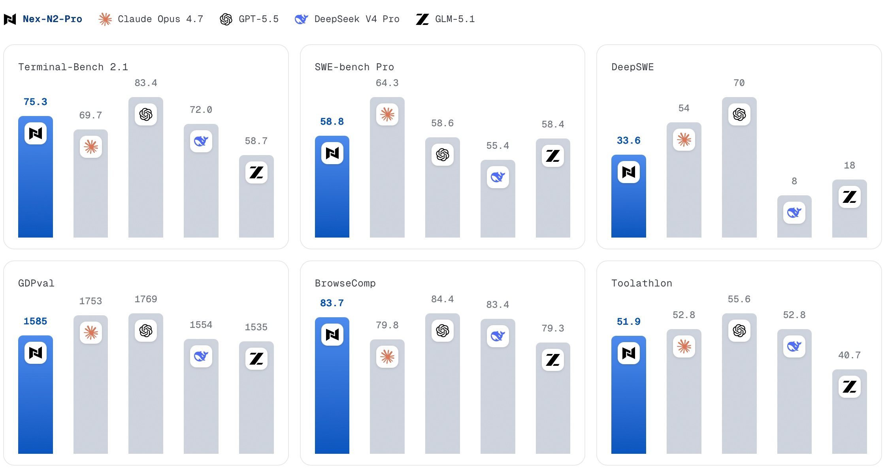

Nex AGI vừa công bố **Nex-N2-Pro**, một model agentic open-source mới nhắm thẳng vào nhóm use case đang nóng nhất hiện nay: coding agent, tool use, terminal execution và các workflow dài hơi có feedback từ môi trường thật.

Điểm gây chú ý không phải chỉ là "thêm một model LLM mới", mà là bảng benchmark được công bố: Nex-N2-Pro đạt **80.8 trên SWE-Bench Verified**, **75.3 trên Terminal-Bench 2.1**, **58.8 trên SWE-Bench Pro**, **83.7 trên BrowseComp** và **90.7 trên GPQA Diamond**. Nếu các con số này được kiểm chứng độc lập, đây là một trong những model open-source đáng theo dõi nhất cho agentic coding trong năm nay.

<!-- truncate -->

## Nex-N2-Pro Là Gì?

Theo model card chính thức, **Nex-N2** là dòng "thinking model" dùng khung **Agentic Thinking**. Ý tưởng là model không chỉ trả lời một lượt, mà có khả năng duy trì vòng lặp hiểu yêu cầu, lập kế hoạch, gọi tool, viết code, nhận feedback, debug và lặp lại.

Nex-N2 có hai biến thể:

- **Nex-N2-Pro**: bản lớn, xây trên `Qwen3.5-397B-A17B`.
- **Nex-N2-mini**: bản nhỏ hơn, xây trên `Qwen3.5-35B-A3B-Base`.

Thông tin từ SiliconFlow cho biết Nex-N2-Pro là kiến trúc **Transformer MoE**, tổng **397B parameters**, context **262K**, max output **256K**, hỗ trợ tool calling, JSON mode và image input. Đây không phải model dành cho laptop thông thường: hướng dẫn local deployment của Nex AGI lấy ví dụ chạy Nex-N2-Pro trên **2 node, mỗi node 8 H100**.

## Vì Sao Benchmark Đáng Chú Ý?

Các benchmark được Nex AGI công bố tập trung vào đúng những thứ coding agent cần:

| Benchmark | Nex-N2-Pro | Ý nghĩa nhanh |
|---|---:|---|
| SWE-Bench Verified | 80.8 | Sửa issue thật trong repo thật |
| SWE-Bench Pro | 58.8 | Biến thể SWE khó hơn |
| Terminal-Bench 2.1 | 75.3 | Làm việc qua terminal, chạy lệnh, xử lý môi trường |
| BrowseComp | 83.7 | Tìm kiếm và tổng hợp thông tin qua web |
| Toolathlon | 51.9 | Khả năng dùng tool |
| GPQA Diamond | 90.7 | Reasoning kiến thức khó |

Điểm thú vị là Nex-N2-Pro không chỉ khoe benchmark coding kiểu "viết hàm cho đúng test". Nó đang cố chứng minh năng lực ở **end-to-end agent workflow**: đọc repo, sửa code, chạy test, dùng terminal, search, gọi tool và tự điều chỉnh độ sâu suy luận.

Với team đang dùng Claude Code, Cursor, OpenClaw, Codex CLI hoặc các harness agentic khác, đây là hướng rất đáng quan sát. Nếu model vừa open-source vừa đủ mạnh ở SWE/terminal/tool-use, chi phí và quyền kiểm soát deployment có thể thay đổi khá nhiều.

## Agentic Thinking: Nghe Hay, Nhưng Cần Đo Thật

Nex AGI mô tả hai ý chính:

- **Adaptive Thinking**: model tự quyết định khi nào cần nghĩ sâu, khi nào nên hành động nhanh. Họ claim cách này giảm 30-50% thinking tokens so với always-on reasoning trong khi giữ hoặc tăng hiệu năng.
- **Coherent Thinking**: dùng một kiểu suy luận nhất quán cho coding, search, tool use và tác vụ đa bước, thay vì mỗi capability là một mảnh rời rạc.

Nếu đúng, đây là mảnh ghép rất hợp với coding agent. Vấn đề của agent không chỉ là câu trả lời cuối đúng hay sai, mà là **khả năng đi qua nhiều bước mà không lạc hướng**: sửa một file, chạy test, đọc lỗi, quay lại sửa, kiểm tra side effect, rồi viết summary/PR.

Nhưng phần này vẫn nên giữ thái độ tỉnh táo. Benchmark trong model card là benchmark do nhà phát hành công bố. Với model mới, thứ cần chờ là:

- leaderboard độc lập cập nhật lại;
- người dùng thực tế chạy trên repo lớn;
- so sánh latency/cost với model thương mại;
- kiểm tra hallucination khi tool output nhiễu;
- đánh giá bảo mật khi dùng trong agent có quyền chạy lệnh.

Nói ngắn gọn: **con số rất đẹp, nhưng chưa nên giao production repo cho nó chỉ vì một bảng benchmark**. TARS approves this level of skepticism.

## Dùng Được Ở Đâu?

Hiện Nex-N2-Pro đã có model card trên Hugging Face, ModelScope, GitHub và được SiliconFlow liệt kê là available. Model card cũng nhắc tới OpenRouter free access trong hai tuần bắt đầu từ ngày 9/6.

Với cá nhân hoặc team nhỏ, hướng thử hợp lý nhất là dùng qua provider/API trước, không tự host. Tự host bản Pro cần hạ tầng quá lớn. Bản mini có vẻ thực tế hơn nếu muốn thử self-host trên cụm nhỏ, nhưng vẫn nên đo kỹ latency, memory và chất lượng.

Use case đáng thử:

- coding agent trên repo vừa và lớn;
- bug fixing có vòng lặp test rõ ràng;
- tool-calling workflow nhiều bước;
- research agent cần browse/search;
- benchmark nội bộ so với Claude/GPT/Gemini/Qwen/DeepSeek.

## Kết Luận Nhanh

Nex-N2-Pro là một launch đáng để ý vì nó đánh đúng vào cuộc đua mới của LLM: không chỉ "trả lời hay", mà **làm việc được trong môi trường thật**. Các con số như SWE-Bench Verified 80.8 và Terminal-Bench 2.1 75.3 đặt nó vào nhóm rất mạnh nếu được xác nhận độc lập.

Tôi sẽ chưa gọi đây là "model thay thế Claude/GPT" ngay. Nhưng nếu bạn quan tâm coding agent, OpenClaw, self-hosted agent stack hoặc tối ưu chi phí inference, Nex-N2-Pro xứng đáng nằm trong shortlist để test trong tuần này.

Nguồn tham khảo:

- [Hugging Face: nex-agi/Nex-N2-Pro](https://huggingface.co/nex-agi/Nex-N2-Pro)
- [ModelScope: Nex-N2-Pro](https://modelscope.ai/models/nex-agi/Nex-N2-Pro/summary)
- [SiliconFlow: Nex-N2-Pro model info](https://www.siliconflow.com/zh-tw/models/nex-n2-pro)
- [GitHub: nex-agi/Nex-N2](https://github.com/nex-agi/Nex-N2)
