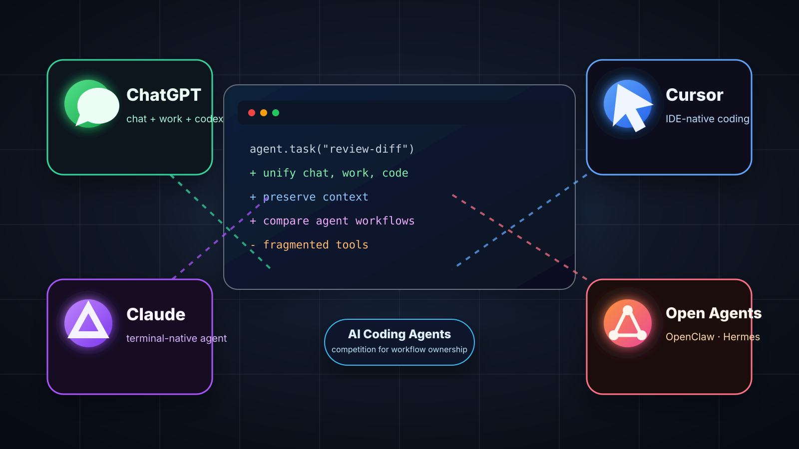

Trong vài năm qua, ChatGPT đã trở thành nơi nhiều người bắt đầu suy nghĩ: hỏi nhanh, phân tích vấn đề, viết tài liệu, thiết kế hệ thống. Nhưng khi bước sang phần thực thi, nhất là viết code, nhiều người lại mở công cụ khác như Claude Code, Cursor, OpenClaw, Hermes hoặc một coding agent trong terminal.

Nói ngắn gọn: ý tưởng nằm ở ChatGPT, còn phần làm thật lại nằm ở nơi khác. Người dùng phải copy bối cảnh, chuyển công cụ, giải thích lại yêu cầu, rồi tự nối phần suy nghĩ với phần thực thi. Release mới của OpenAI đáng chú ý vì nó xử lý đúng điểm đứt đó.

OpenAI công bố desktop app mới của ChatGPT gộp Chat, Work và Codex vào cùng một ứng dụng: Chat cho hỏi đáp, Work cho nghiên cứu hoặc tạo đầu ra hoàn chỉnh, Codex cho phát triển phần mềm. Codex app cũng được đưa vào ChatGPT desktop app mới, kèm các năng lực như chỉnh sửa trực tiếp trong diff, review pull request ở side panel, computer use nhanh hơn và hỗ trợ nhiều repository trong một project. Nguồn: [OpenAI release notes](https://openai.com/products/release-notes/), [OpenAI announcement](https://openai.com/index/chatgpt-for-your-most-ambitious-work/), [migration guidance](https://help.openai.com/en/articles/20001276-moving-to-the-new-chatgpt-desktop-app).

<!-- truncate -->

## Vì Sao Trải Nghiệm Này Quan Trọng?

Đây không chỉ là chuyện gộp app. Đây là thay đổi về trải nghiệm làm việc với AI.

Một developer hoặc AI product engineer thường làm theo chuỗi: nghĩ về vấn đề, đọc tài liệu, chốt hướng tiếp cận, sửa code, chạy test, review diff, viết PR description, rồi cập nhật cho team. Nếu mỗi bước nằm ở một công cụ khác nhau, công việc bị chia mảnh.

Chat, Work và Codex tương ứng với ba nhu cầu khác nhau. Chat để nghĩ nhanh và làm rõ vấn đề. Work để nghiên cứu, tổng hợp, tạo tài liệu, slide, spreadsheet, report hoặc site. Codex để làm việc với repo, terminal, local files, test suite và pull request. Nguồn: [ChatGPT Work and Codex](https://help.openai.com/en/articles/20001275).

Điểm mạnh của release này là OpenAI đưa coding agent về gần nơi người dùng đã quen suy nghĩ: ChatGPT. Với người đã dùng ChatGPT mỗi ngày để phân tích và viết tài liệu, chuyển sang Codex trong cùng app để sửa repo là một bước rất nhỏ.

Điều này cũng làm Codex được đặt đúng chỗ hơn. Một vấn đề kỹ thuật hiếm khi chỉ nằm trong code. Nó thường bắt đầu từ yêu cầu sản phẩm, tài liệu kiến trúc, issue, email hoặc số liệu, rồi mới đi đến repo.

## Điều Còn Thiếu: Chọn Model Bên Ngoài Ngay Trong ChatGPT/Codex

Một điểm cần nói rõ: ChatGPT Work và Codex hiện vẫn chưa phải một lớp mở hoàn toàn để người dùng chọn model bên ngoài như GLM-5.2, Qwen, Kimi hay DeepSeek ngay trong trải nghiệm sản phẩm.

Với Work, tài liệu hiện tại chủ yếu nói về các model GPT theo plan và mức reasoning trong ChatGPT. Với Codex local clients, OpenAI có nói đến `config.toml`, custom model providers, proxy, Ollama, Mistral, Amazon Bedrock và provider tương thích Chat Completions API hoặc Responses API. Nhưng đây là cấu hình kỹ thuật cho local client, không phải trải nghiệm chính thức kiểu "chọn GLM-5.2/Qwen/Kimi/DeepSeek" như model picker. Codex cloud tasks hiện cũng chưa cho đổi default model. Nguồn: [Codex models](https://developers.openai.com/codex/models), [Codex advanced configuration](https://developers.openai.com/codex/config-advanced), [Codex authentication](https://developers.openai.com/codex/auth).

Nếu trong tương lai OpenAI mở rõ hơn hướng này, đây sẽ là điểm rất hấp dẫn với developer. Khi đó có thể chọn model theo quota, chi phí, độ ổn định hoặc yêu cầu hạ tầng nội bộ. Điều này càng đáng chú ý khi nhiều developer nhạy cảm với giới hạn sử dụng của Claude Code. Anthropic có tài liệu nói Claude và Claude Code dùng chung usage limits trên Pro/Max; khi chạm giới hạn, người dùng phải chờ reset hoặc dùng usage credits/API rate. Nguồn: [Claude Code with Pro or Max plan](https://support.anthropic.com/en/articles/11145838-using-claude-code-with-your-pro-or-max-plan), [Understanding Claude usage limits](https://support.anthropic.com/en/articles/11647753-understanding-usage-and-length-limits), [Anthropic restrictions for unsupported regions](https://www.anthropic.com/news/updating-restrictions-of-sales-to-unsupported-regions).

## Tác Động Tới Claude Code, Cursor, OpenClaw Và Hermes

Claude Code có lợi thế terminal-native: gần developer, mạnh, ít màu mè. Cursor có lợi thế IDE-native: code ở đâu, AI ở đó. OpenClaw, Hermes và các agent framework khác hấp dẫn với nhóm thích tuỳ biến sâu.

ChatGPT không nhất thiết phải thắng bằng cách sao chép từng trải nghiệm đó.

Nước đi đáng chú ý hơn là gom nhiều phần việc về một nơi: chat, research, tài liệu, local work, coding, PR review, plugin, scheduled task và sites. Khi đó, ChatGPT cạnh tranh để trở thành nơi người dùng mở ra mỗi khi bắt đầu làm việc với AI.

Thị trường sẽ không chỉ còn một người thắng. Developer tools luôn phân hoá theo thói quen và gu làm việc. Nhưng release này làm rõ một điều: cuộc chơi coding agent không còn chỉ là "model nào viết code tốt hơn". Câu hỏi lớn hơn là: ai giữ được mạch làm việc từ ý tưởng đến shipping?

## Bài Học Cho AI Product Teams

Có ba bài học lớn. Agent không nên chỉ là API hoặc một ô chat; để thật sự làm việc, nó cần file, tool, permission, state, review, artifact và môi trường thực thi. Các chế độ làm việc cũng cần rõ ràng: Chat để nghĩ nhanh, Work để tạo đầu ra hoàn chỉnh, Codex để làm software engineering. Và khi agent chạm vào local files, desktop apps, browser, repo hoặc terminal, quyền kiểm soát của người dùng phải là trung tâm: biết AI đang làm gì, có thể dừng lại, đổi hướng, review và approve các hành động quan trọng.

## Kết Luận

Tôi xem release này là một bước tiến quan trọng của ChatGPT về trải nghiệm làm việc. Không phải vì OpenAI thêm vài tính năng mới, mà vì ChatGPT đang đi từ nơi "trò chuyện với AI" thành nơi "làm việc cùng AI".

Với người thường xuyên dùng ChatGPT để suy nghĩ nhưng lại phải mở Claude Code, Cursor hoặc một coding agent khác để thực thi, việc Chat, Work và Codex cùng nằm trong một app giúp mạch làm việc liền hơn nhiều.

Trong kỷ nguyên agentic software, sản phẩm thắng không chỉ là sản phẩm có model mạnh nhất. Sản phẩm thắng là sản phẩm giữ được bối cảnh, làm việc tự nhiên với thói quen của người dùng, và khiến AI giống một cộng sự thật sự hơn là nhiều công cụ rời rạc.
