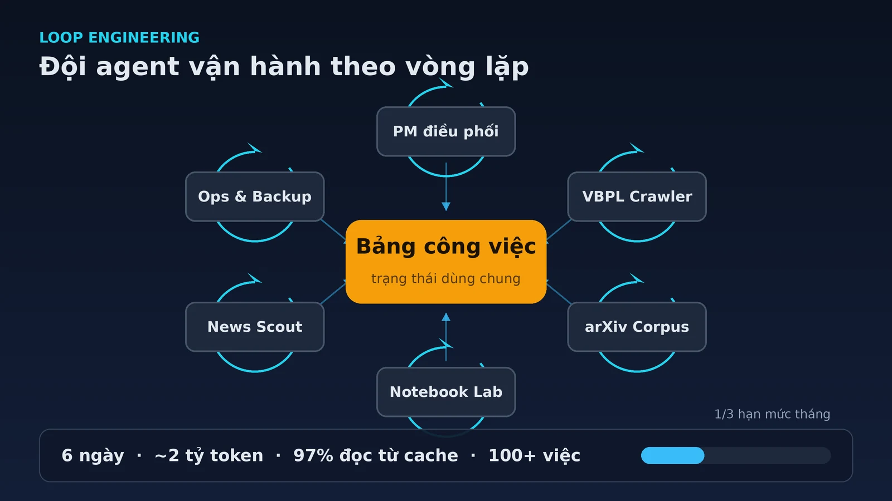

Sáu ngày gần đây, một "đội" agent của tôi chạy xong hơn 100 task: crawl và kiểm tra toàn vẹn 156.404 văn bản pháp luật, làm sạch metadata cho 3,19 triệu paper arXiv, dựng một knowledge base ba tầng có vector, và chạy backup 26 GB mỗi ngày. Tôi gói gọn trong một gói thuê bao khoảng **$10/tháng**, và trong 6 ngày đó hệ thống đốt khoảng **2 tỷ token** — trong đó **97% là cache read**.

Nhưng con số ấn tượng không phải phần khó nhất. Phần khó là giữ cho nhiều agent chạy đều, rẻ, không kẹt, và biết dừng đúng lúc.

Prompt engineering giải quyết một lượt gọi model. **Loop engineering** giải quyết cả vòng vận hành: cái gì chạy, chạy bao lâu một lần, tốn bao nhiêu token mỗi vòng, và khi nào thì dừng. Bài này kể cấu trúc agent team của tôi, cách tôi thiết kế từng vòng lặp, số liệu thật — kể cả phần dở, vì đó mới là phần đáng nói.

<!-- truncate -->

## 1. Agent team của tôi chạy như thế nào

Điểm tôi muốn tách bạch ngay: đây không phải chuyện "chat với nhiều agent". Đây là một tổ chức nhỏ có phân vai, có board, có quy trình bàn giao.

Tôi dùng nhiều session chuyên trách trên opencode, mỗi session một vai:

| Agent | Vai trò | Output chính |
|---|---|---|
| Product Manager | Điều phối, ưu tiên hóa, nghiệm thu | Task được giao và đóng |
| VBPL Crawler | Crawl, audit, xử lý văn bản pháp luật | 156.404 văn bản + artifact |
| arXiv Corpus | Thu thập và làm sạch metadata học thuật | 3,19 triệu paper |
| Notebook Lab | Thử nghiệm, PoC, benchmark | Notebook và báo cáo kỹ thuật |
| News Scout | Trinh sát tin tức AI, kiểm chứng chéo | Bản tin có nguồn |
| Ops / Backup | Hạ tầng, backup, xử lý sự cố | Backup 26 GB/ngày |

Thứ giữ đội này lại với nhau không phải một framework orchestration, mà là một **task board chung** (Notion) làm workspace giữa người và agent. Tôi và các agent cùng đọc, cùng ghi trên đó. Nghe đơn giản, nhưng nó quyết định gần như toàn bộ phần còn lại của bài.

## 2. Loop engineering: thiết kế vòng lặp, không phải viết prompt hay

Anthropic định nghĩa agent gọn tới mức khó tin: *"LLM autonomously using tools in a loop"* — một model tự dùng công cụ trong một vòng lặp. Vòng lặp đó không tự nhiên đúng. Nó cần được thiết kế.

Nền tảng học thuật thì đã có sẵn. [ReAct](https://arxiv.org/abs/2210.03629) cho model xen kẽ suy luận và hành động; [Reflexion](https://arxiv.org/abs/2303.11366) cho agent tự phản tư sau mỗi lần thất bại. Nhưng khi đưa lên production, câu hỏi không còn là "agent có biết phản tư không", mà là "vòng phản tư đó tốn bao nhiêu và chạy bao lâu một lần".

Trong hệ thống của tôi, "loop engineering" là một tập hợp các vòng lặp vận hành cụ thể, mỗi vòng có nhịp chạy, nhiệm vụ rõ, và điều kiện dừng:

| Loop | Nhịp | Nhiệm vụ | Có gọi LLM? |
|---|---|---|---|
| PM loop | 15 phút (off-peak), 1 giờ (peak) | Quét task Ready, đánh giá rủi ro, giao việc | Có |
| Watchdog | 5 phút | Kiểm tra process nền, restart khi chết | Không |
| Check comment | mỗi vòng PM | Đọc comment mới trên task đang mở | Có (khi có việc) |
| Check stalled | mỗi vòng PM | Bắt task "mồ côi" | Không |
| Backup | 03:00 hằng ngày | Sao lưu 26 GB lên cloud | Không |
| Verify dispatch | sau mỗi dispatch | Xác nhận job thực sự sống | Không |

Có hai quyết định thiết kế quan trọng ở đây.

Thứ nhất, **việc cơ học không được gọi LLM**. Crawl, harvest, embed, backup, kiểm tra process đều là script Python hoặc bash, tốn 0 token. Chỉ những việc cần phán đoán — đánh giá rủi ro, viết, tổng hợp — mới gọi model. Đây là lý do một đội agent chạy cả ngày mà hóa đơn vẫn nhỏ.

Thứ hai, **mỗi vòng lặp phải có nhịp theo giá**. Nhà cung cấp tính giá peak cao gấp đôi ngoài giờ. Vòng kiểm tra nhẹ thì chạy dày (15 phút), việc nặng như embed hay crawl lớn thì dồn về off-peak (17:00–08:00 và cuối tuần). Chính sách "off-peak first" này về sau thành một đề xuất chính thức trong bản đánh giá nội bộ.

## 3. Board là bộ nhớ, không phải chat history

Sai lầm phổ biến khi dựng agent team là để mỗi session tự nhớ mọi thứ trong context. Cách đó sập rất nhanh.

Anthropic gọi hiện tượng này là **context rot**: khi số token trong context tăng, khả năng truy hồi chính xác của model giảm, dù đó là các model tốt nhất. Nghiên cứu [Context Rot](https://research.trychroma.com/context-rot) của Chroma cho thấy model xử lý context không đồng đều chút nào — càng dài càng kém ổn định, ngay cả với task đơn giản.

Giải pháp của tôi là kéo state ra khỏi context, để trên board và trong file:

- **Task board** giữ trạng thái mỗi task: `Ready`, `In Progress`, `Review`, `Blocked`, `Done`.
- `dispatch-log.md` ghi mọi lần giao việc và nghiệm thu.
- `comments-seen.json` nhớ comment nào đã xử lý, để không trả lời trùng.
- `jobs.json` là registry các job nền đang chạy.

Mỗi vòng lặp đọc board, quyết định, ghi lại, rồi thoát. Session không cần nhớ lịch sử dài. Cách này khớp với ba kỹ thuật Anthropic khuyến nghị cho agent chạy dài: **compaction** (nén context khi gần đầy), **structured note-taking** (ghi chú ra bộ nhớ ngoài), và **sub-agent** (mỗi agent con có context sạch, trả về bản tóm tắt ngắn).

```text
        ┌──────────────── Task board ────────────────┐
        │  Ready → In Progress → Review → Done        │
        └───────▲──────────────────────────┬──────────┘
                │                          │ đọc
          ghi trạng thái                   ▼
        ┌───────┴──────┐          ┌─────────────────┐
        │  PM loop     │─────────▶│  Agent worker   │
        │  (điều phối) │ dispatch │  (VBPL/arXiv…)  │
        └──────────────┘          └─────────────────┘
```

## 4. Kinh tế token: cache là nhân vật chính

2 tỷ token trong 6 ngày nghe rất nhiều, nhưng 97% trong đó là **cache read** — phần prefix đã gửi trước đó được tái sử dụng thay vì tính như token mới.

DeepSeek mô tả cơ chế [context caching](https://api-docs.deepseek.com/guides/kv_cache) rất rõ: nếu request sau có prefix trùng với request trước, phần trùng đó chỉ được đọc từ cache, tính là "cache hit". Trong bảng giá tôi dùng, cache read rẻ khoảng **50 lần** so với token input thường. Đây chính là lý do một vòng PM loop đọc lại context 60–200K token mà chỉ tốn vài phần nghìn đô.

Điều này dẫn tới một kết luận mà tôi phải mất một thời gian mới nhận ra: **chi phí tỉ lệ với số lần gọi nhân với kích thước context, không phải với tier model**. Tôi từng nghĩ dùng model rẻ hơn cho vòng kiểm tra sẽ tiết kiệm. Sai. Cái quyết định là context phình bao nhiêu và gọi bao nhiêu lần.

Số liệu thật trong một cửa sổ 4,4 ngày (30/09–04/10), quy đổi theo giá API lẻ và điều chỉnh cho giờ peak:

| Session | Token vào | Cache read | Chi phí tương đương |
|---|---|---|---|
| VBPL Crawler | 11,18M | 666,9M | ~$5,63 |
| PM loop | 11,06M | 318,3M | ~$3,69 |
| Main (người dùng) | 8,74M | 278,5M | ~$2,89 |
| Notebook Lab | 5,63M | 294,5M | ~$2,29 |
| arXiv Corpus | 4,20M | 107,1M | ~$1,20 |
| News Scout | 0,96M | 13,1M | ~$0,24 |

Vì sao con số quan trọng: Anthropic đo được agent thường dùng **gấp ~4 lần** token so với chat thường, và hệ multi-agent **gấp ~15 lần**. Multi-agent không miễn phí — nó là cách tiêu token để mua năng lực. Chỉ hợp lý khi task đủ giá trị và ta kiểm soát được mỗi vòng lặp tốn bao nhiêu.

## 5. Loop nào đáng tiền, loop nào đốt tiền

Đây là phần tôi muốn nói thẳng.

Trong 4,4 ngày đó, PM loop chạy **324 vòng** và khoảng **56% là noop** — chạy xong không làm gì. Riêng phần noop ước tính tốn **$10–13/tháng** theo giá API, tức khoảng **23% tổng chi phí**. Nói cách khác, gần một phần tư công suất đi vào việc "kiểm tra xem có gì mới không" rồi kết luận là không.

Ba nút thắt lớn nhất lộ ra từ đánh giá:

1. **Chờ người duyệt.** Có task chờ tôi duyệt rủi ro tới **30 giờ**, một task khác **10,8 giờ**, một task treo **33 giờ+**. Agent rảnh 85–99% thời gian. Nút thắt thật không nằm ở năng lực agent, mà ở vòng phê duyệt của con người.
2. **PM loop overhead và context phình.** Vòng noop chỉ tốn ~$0,006, nhưng context mỗi vòng phình lên 60–200K token, và session PM bị nén (compaction) xóa lịch sử **16 lần** trong cửa sổ đo — mất ngữ cảnh, có nguy cơ bỏ sót.
3. **Giám sát job nền kiểu bị động.** Có **58 lần** watchdog phải restart một job, có đợt "bão restart" 17 lần trong 1,5 giờ. Một job chết im lặng cho tới khi tôi tự phát hiện.

Điểm chung: tôi đã tối ưu phần thú vị (model, prompt) nhưng lại bỏ quên phần vận hành tẻ nhạt — nhịp, điều kiện dừng, và giám sát.

## 6. Ba thứ đã sửa, ba thứ còn mở

Bản đánh giá nội bộ đưa ra 6 đề xuất. Tôi chọn làm 3 cái không ảnh hưởng chất lượng trước.

**Đã sửa:**

- **Quét task "mồ côi" (#2).** Viết `check-stalled.py`: task đang `In Progress` mà PID không còn sống, log stale quá 2 giờ, và không nằm trong whitelist thì bị gắn cờ. Nó bắt được đúng lỗ hổng V70 — task bị đánh dấu đang chạy nhưng không ai dispatch, trễ 10,8 giờ. Script cross-check với registry job nền để không gắn cờ oan.
- **Off-peak first (#4).** Đưa thành quy tắc dispatch: việc nặng ưu tiên khung 17:00–08:00 và cuối tuần. Không đổi cron, chỉ đổi thứ tự ưu tiên.
- **Supervisor có backoff (#5).** Thay vì restart cứng mỗi 5 phút, supervisor restart với backoff 5'→10'→20'→30', và cảnh báo khi hết lượt. Hết bão restart.

**Còn mở, và tôi chưa làm:**

- **Pre-check gate (#1).** Cho một script determinist chạy mỗi 15 phút để kiểm tra board, comment, process; chỉ gọi `opencode run` khi thật sự có việc mới. Đây là đề xuất tiết kiệm lớn nhất (~$8–12/tháng) vì nó xử lý trực tiếp 56% vòng noop — nhưng nó chạm vào logic điều phối, nên tôi để sau.
- **Tách session VBPL (#3).** Một session chạy liên tục từ tháng 7 tích lũy context ~432K token mỗi message, khoản cache-read đắt nhất hệ thống. Cần tách "crawl/DB-ops" khỏi "KB R&D", kèm handoff doc.
- **Giảm context PM (#6).** Hạ ngưỡng compaction và chuyển state quan trọng ra file nhiều hơn.

Tôi cố tình không làm cả 6 cùng lúc. Mỗi thay đổi trong vòng điều phối đều có thể gây hiệu ứng dây chuyền, và tôi muốn test từng cái một.

## 7. Vài bài học

**Loop phải rẻ trước khi thông minh.** Một vòng lặp chạy 15 phút một lần mà mỗi lần tốn vài trăm nghìn token sẽ âm thầm ăn hết ngân sách. Tối ưu nhịp và context trước, thêm năng lực sau.

**Nút thắt thường là con người, không phải model.** 30 giờ chờ duyệt lớn hơn mọi độ trễ kỹ thuật trong hệ thống. Tự động hóa vòng lặp mà không tự động hóa phê duyệt thì chỉ đẩy hàng đợi sang chỗ khác.

**Observability trước autonomy.** Không trace được retrieval, ranking, và từng quyết định của agent thì không sửa được gì. Tôi phải xây log và registry trước khi dám cho agent chạy nền.

**Multi-agent không miễn phí.** Gấp ~15 lần token so với chat. Nó hợp với task song song được, giá trị cao (như thu thập và làm sạch dữ liệu), nhưng không hợp với task ràng buộc chặt và ít song song. Anthropic cũng cảnh báo điều này.

**Board là hạ tầng, không phải phụ lục.** Một task board chung làm bộ nhớ ngoài cho cả người và agent rẻ hơn, bền hơn, và minh bạch hơn mọi cơ chế "AI tự nhớ".

## Kết

Tôi không nghĩ mình đang "thay người bằng AI". Tôi đang chạy một mô hình đơn giản hơn: **một người + một quy trình tốt + một đội agent**. Con số hơn 100 task trong 6 ngày không đến từ model thông minh hơn, mà từ việc thiết kế vòng lặp đủ rẻ và đủ rõ để chạy mà không cần tôi đứng cạnh.

Việc tiếp theo khá rõ: dựng pre-check gate determinist trước PM loop, để các vòng "kiểm tra xem có gì mới không" ngừng đốt token. Đó là cách trực tiếp nhất để cắt 56% vòng noop.

## Tài liệu tham khảo

1. [Building effective agents](https://www.anthropic.com/engineering/building-effective-agents) — Anthropic, 12/2024; phân biệt workflow và agent, cùng các pattern orchestrator-workers và evaluator-optimizer.
2. [How we built our multi-agent research system](https://www.anthropic.com/engineering/multi-agent-research-system) — Anthropic, 06/2025; số liệu agent dùng ~4× token và multi-agent ~15× token so với chat.
3. [Effective context engineering for AI agents](https://www.anthropic.com/engineering/effective-context-engineering-for-ai-agents) — Anthropic, 09/2025; compaction, ghi chú có cấu trúc, sub-agent.
4. [Context Rot: How Increasing Input Tokens Impacts LLM Performance](https://research.trychroma.com/context-rot) — Chroma, 07/2025.
5. [ReAct: Synergizing Reasoning and Acting in Language Models](https://arxiv.org/abs/2210.03629) — Yao và cộng sự, 2022.
6. [Reflexion: Language Agents with Verbal Reinforcement Learning](https://arxiv.org/abs/2303.11366) — Shinn và cộng sự, 2023.
7. [Context Caching](https://api-docs.deepseek.com/guides/kv_cache) — DeepSeek API Docs.
8. [Measuring AI Ability to Complete Long Software Tasks](https://arxiv.org/abs/2503.14499) — METR, 2025; nền tảng cho thảo luận về độ dài tác vụ mà agent có thể tự hoàn thành.

*Số liệu vận hành được chốt từ bản đánh giá nội bộ ngày 04/10/2026; nguồn tham khảo ngoài được kiểm tra ngày 05/10/2026.*
