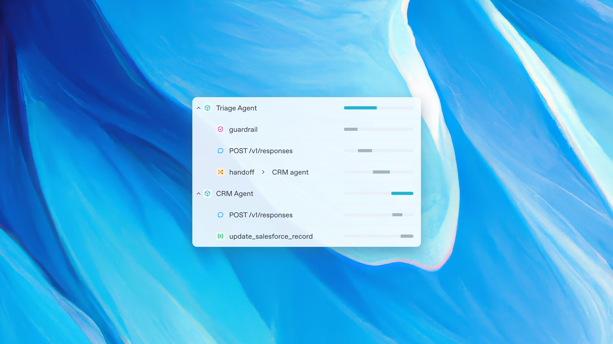

## Tin tức tóm tắt: OpenAI ra mắt công cụ mới để xây dựng AI Agent

OpenAI công bố bộ công cụ và API mới vào ngày 11/03/2025, nhằm hỗ trợ lập trình viên và doanh nghiệp xây dựng các AI Agent tự động, đáng tin cậy. Các điểm chính:

- **Responses API**: Kết hợp tính năng của Chat Completions API và Assistants API, cho phép tạo agent với các công cụ tích hợp như tìm kiếm web, tìm kiếm tệp, và điều khiển máy tính. API này thay thế Assistants API (sẽ ngừng hoạt động vào giữa năm 2026).
- **Công cụ tích hợp**:
  - **Tìm kiếm web**: Sử dụng GPT-4o và GPT-4o-mini để cung cấp câu trả lời cập nhật kèm nguồn tham khảo.
  - **Tìm kiếm tệp**: Tìm thông tin nhanh trong cơ sở dữ liệu doanh nghiệp (OpenAI cam kết không dùng dữ liệu này để huấn luyện).
  - **Điều khiển máy tính**: Dùng mô hình CUA (Computer-Using Agent) để tự động hóa tác vụ như nhập liệu, duyệt web.
- **Agents SDK**: Bộ công cụ mã nguồn mở giúp quản lý luồng công việc của agent đơn hoặc đa agent, tích hợp với hệ thống nội bộ và các mô hình không phải OpenAI.
- **Mục tiêu**: Đơn giản hóa việc phát triển agent, tăng năng suất trong các ngành công nghiệp bằng hệ thống tự động hóa tác vụ phức tạp.

OpenAI nhấn mạnh đây là bước đầu để đưa AI Agent vào lực lượng lao động, với kế hoạch bổ sung thêm tính năng trong tương lai.

Nguồn: [https://openai.com/index/new-tools-for-building-agents/](https://openai.com/index/new-tools-for-building-agents/)