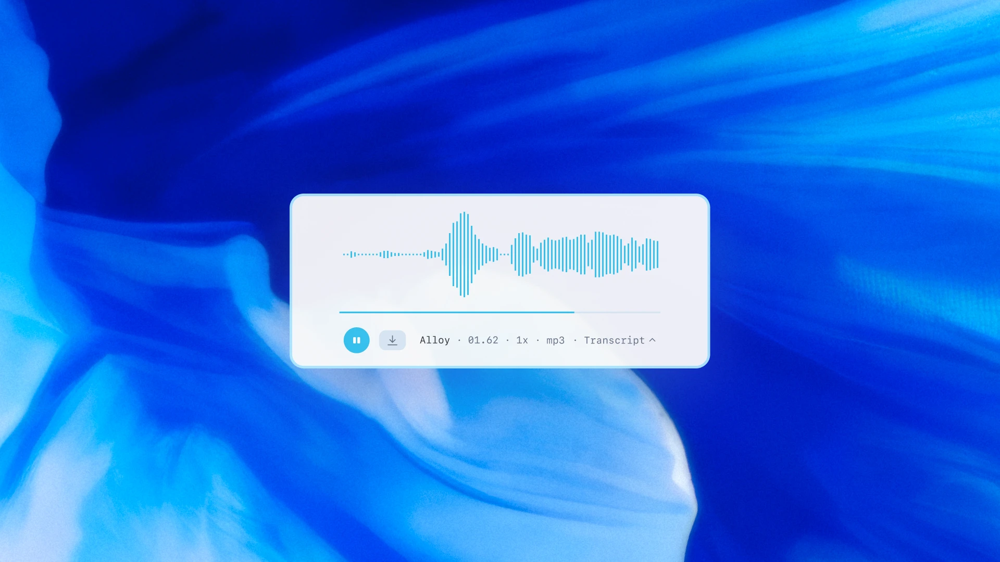

## Tin tức tóm tắt: OpenAI giới thiệu các mô hình âm thanh thế hệ mới trong API

OpenAI công bố ra mắt các mô hình âm thanh mới trong API vào ngày 20/03/2025, bao gồm hai mô hình chuyển giọng nói thành văn bản (speech-to-text) là **gpt-4o-transcribe** và **gpt-4o-mini-transcribe**, cùng một mô hình chuyển văn bản thành giọng nói (text-to-speech) là **gpt-4o-mini-tts**.

<!-- truncate -->

## Các điểm chính:

- **Mô hình chuyển giọng nói thành văn bản**: Được cải tiến từ Whisper, đạt độ chính xác cao hơn nhờ học tăng cường (reinforcement learning) và huấn luyện trên tập dữ liệu âm thanh đa dạng, chất lượng cao. Chúng xử lý tốt các tình huống phức tạp như giọng nói có accent, môi trường ồn ào, hoặc tốc độ nói khác nhau.
- **Mô hình chuyển văn bản thành giọng nói**: Cho phép tùy chỉnh cách nói (ví dụ: "nói như nhân viên chăm sóc khách hàng đồng cảm"), mang lại giọng nói tự nhiên, biểu cảm hơn, hỗ trợ xây dựng các trợ lý giọng nói linh hoạt.
- **Ứng dụng thực tế**: Các mô hình này tích hợp với Agents SDK, giúp lập trình viên dễ dàng phát triển trợ lý giọng nói thông minh hơn, từ hỗ trợ khách hàng đến ghi chú cuộc họp.
- **Hiệu suất và chi phí**: Các mô hình mới vượt trội về độ chính xác và hiệu quả so với các phiên bản trước, với chi phí hợp lý (ví dụ: gpt-4o-mini-tts khoảng $0.015/phút âm thanh tạo ra).

OpenAI nhấn mạnh đây là bước tiến trong việc xây dựng các hệ thống AI tự động (agentic systems), hứa hẹn nâng cao trải nghiệm tương tác bằng giọng nói trong tương lai.

<!-- truncate -->

Nguồn: [https://openai.com/index/introducing-our-next-generation-audio-models/](https://openai.com/index/introducing-our-next-generation-audio-models/)
