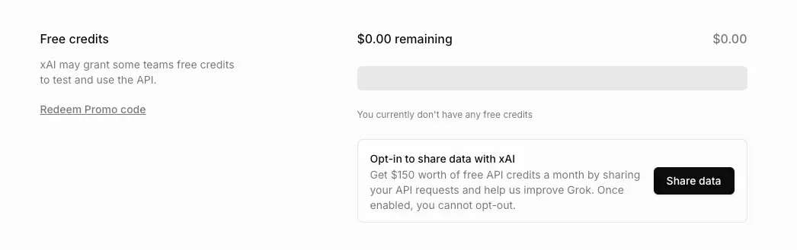

## xAI cung cấp $150 miễn phí hàng tháng cho các đội nhóm tham gia chia sẻ dữ liệu

xAI đang cung cấp $150 tín dụng API miễn phí mỗi tháng cho các đội nhóm tham gia chia sẻ dữ liệu (áp dụng tại các quốc gia đủ điều kiện). Bằng cách tham gia, bạn đồng ý chia sẻ các yêu cầu API của mình với xAI.

_Để đủ điều kiện nhận tín dụng miễn phí, đội nhóm của bạn phải đã chi tiêu tối thiểu $5 cho API trước khi chọn tham gia._

<!-- truncate -->

## Hình thức tham gia

- Chia sẻ dữ liệu được thiết lập ở cấp độ đội nhóm.
- Bạn có thể có nhiều đội nhóm—một số tham gia, một số không.
- Chỉ quản trị viên đội nhóm mới có thể bật chia sẻ dữ liệu.
- Để tham gia, hãy vào phần [Tín dụng](https://console.x.ai/team/default/billing/credits) trên trang Thanh toán của xAI API Console.
- Sau khi một đội nhóm đã chọn tham gia chia sẻ dữ liệu, đội nhóm đó không thể hủy tham gia.

## Quốc gia đủ điều kiện

Rất vui là xAI đã mở rộng chương trình tín dụng miễn phí cho các đội nhóm ở Việt Nam.

Danh sách các quốc gia không đủ điều kiện xem tại [https://docs.x.ai/docs/data-sharing#country-eligibility](https://docs.x.ai/docs/data-sharing#country-eligibility).
